# Banco de Dados

## O que é um Banco de Dados?
* Definição simples: coleção organizada e estruturada de informações
*   ```
    Um banco de dados é uma coleção lógica e coerente de dados com significado inerente, projetado, construído e populado com dados para um próposito específico.

    C.J Date, em "Introdução a Sistemas de Banco de Dados" 
    ```
* Exemplo prático: agenda de contatos do celular
  * Registro: cada contato
  * Campo: nome, telefone, e-mail
* Exemplo: planilha de gastros mensais (Excel)

* Conceitos-chave:
  * Dados: Informações brutas, como números ou palavras.
  * Informações: São dados organizados e estruturados, de forma que façam sentido e possam ser usados para tomar decisões
  * Registro e Campo: São linhas e colunas que formam a tabela de um banco de dados. São utilizados para estruturar as informações em um banco de dados.
  * Registro (linha): É o item específico 
  * Campo (coluna): Detalhe sobre o item

## Por que os Banco de Dados são importantes?
* Organização e rapidez na recuperação das informações
* Integridade e segurança dos dados
* Suporte a aplicações complexas
* Exemplo prático: funcionamento do Uber

## Tipos Básicos de Banco de Dados
* Bancos Relacionais (SQL)
  * Estrutura em tabelas (linhas/registros, colunas/campos)
  * Exemplos: PostgreSQL, MySQL, Microsoft SQL Server
  * Linguagem SQL (Structured Query Language)
    * Linguagem que permite que criar, ler, atualizar e deletar informações facilmente.

* Bancos não relacionais (NoSQL)
  * Estrutura flexível (documentos, chave-valor, grafos)
  * Exemplos: MongoDB, Firebase, Redis

* Analogia
  * Relacional: biblioteca organizada
  * Não-Relacional: Caixa com itens variados relacionados

* Onde os Bancos de Dados são usados no dia a dia?
  * Spotify: Gerenciamento de músicas e recomendações
  * Netflix: Histórico e sugestões personalizadas
  * Instagram: Armazenamento e interações com fotos e vídeos
  * Aplicativos bancários: Transações seguras e eficientes

## Introdução ao Mundo dos Banco de Dados
* Bancos Relacionais vs. Não-Relacionais

### O que é um Banco Relacional
* Tabelas como estrutura principal (linhas e colunas)
* SQL como linguagem padrão
* Exemplo de tabelas: usuarios e pedidos

### Banco Relacional
* Chave primária
* Relações entre tabelas (chave estrangeira)
* Vantagens:
  * Estrutura organizada
  * Alta integridade dos dados
  * Ideal para dados estruturados

---

<div>
  <h3>
    usuarios
  </h3>
</div>

| id   | nome  |           email |
| :--- | :---: | --------------: |
| 1    | João  |  joao@email.com |
| 2    | Maria | maria@email.com |

---

<div>
  <h3>
    pedidos
  </h3>
</div>

| id   | id_usuario |  valor |
| :--- | :--------: | -----: |
| 1    |     1      |  50,00 |
| 2    |     1      |  80,00 |
| 3    |     2      | 120,00 |

---

&nbsp;

### Introdução ao SQL e ao PostgreSQL

* **O que é SQL (Structured Query Language)**
  * Linguagem estruturada para consulta de dados em um SGDB (Sistema de gerenciamento de Bando de Dados)
  * Utilizada em bancos relacionais para criar, modificar e consultar dados


* Principais comandos SQL
  * CREATE TABLE: criar tabelas
  * INSERT INFO: inserir dados
  * SELECT: consulta dados
  * UPDATE: atualiza dados
  * DELETE: exclui dados

  ```
    CREATE TABLE -> CRIANDO TABELAS

    CREATE TABLE usuarios (
      id SERIAL PRIMARY KEY,
      nome VARCHAR(100),
      EMAIL VARCHAR(100)
    );

  ```

  ```

    INSERT -> INSERIR DADOS

    INSERT INTO usuarios(nome, email)
    VALUES('Ana Silva', 'ana@email.com')

  ```

  ```

    SELECT -> SELECIONAR DADOS

    SELECT * FROM usuarios;
  ```

## O que é o PostgreSQL?
* Banco de dados relacional open-source
* Seguro, gratuito e robusto

* Características principais:
  * Segurança e confiabilidade
  * Compatível com várias linguagens
  * Suporte a tipos de dados avançados (JSON, arrays, geográficos)
  * Comunidade ativa e global

## Por que aprender SQL com PostgreSQL?
* SQL é uma linguagem padrão (usável em outros bancos)
* Ferramenta gratuita e amigável
* Excelente para iniciantes e projetos avançados

* Vantagens:
  * Aprendizado aplicável em toda a carreira
  * Comunidade de apoio
  * Documentação clara

## Verificando a instalação do PostgreSQL
- Usando o pgAdmin
  * Abra o pgAdmin
  * Digite a senha criada
  * Verifique se o servidor está ativo (ícone verde)

## Instalando o Beekeeper Studio

- Passo a Passo
  * Acesse: beekeeperstudio.io
  * Baixe a versão para o seu sistema
  * instalar normalmente conforme orientado
  * Executar o Beekeeper studio

## Criando a Primeira Conexão no Beekeeper
- Configurações:
  - Connection Name: Postgres Local
  - Host: localhost
  - Port: 5432
  - Username: postgres
  - Password: (senha criada)
  - Database: postgres

## Criando o Primeiro Banco de Dados
- Passos
  * Execute o seguinte comando:
    ```
      CREATE DATABASE agenda;
    ```

  
## Criando a Primeira Tabela
- Passos
  * Execute o seguinte comando:
    ```
      CREATE TABLE (
        id SERIAL PRIMARY KEY,
        nome VARCHAR(100),
        telefone VARCHAR(20)
      );
    ```

  
## Manipulação Bàsica de Dados
- Criação de tabelas simples (CREATE TABLE)
  - ### Criando uma tabela no banco de dados
    * Boas práticas
      * Uma tabela bem criada segue boas práticas desde o início:
        * Estrutura clara e consistente
        * Tipos corretos para cada campo
        * Restrições bem aplicadas
        * Facilidade de manutenção e expansão


    * Passos
      * Execute o seguinte comando:
        ```
          CREATE TABLE clientes(
            id SERIAL PRIMARY KEY,
            nome VARCHAR(100) NOT NULL,
            email VARCHAR(150) UNIQUE NOT NULL,
            data_nascimento DATE,
            saldo NUMERIC(10,2),
            ativo BOOLEAN DEFAULT TRUE,
            criado_em TIMESTAMP DEFAULT CURRENT_TIMESTAMP
          );
        ```

- Tipos de Dados no Postgres
  - Principais tipos
    - Integer (INT, INTEGER, SMALLINT, BIGINT)
      - Números inteiros com diferentes tamanhos

    - Decimal (NUMERIC, DECIMAL, REAL, DOUBLE PRECISION)
      - Números com ponto flutuante.
      - NUMERIC e DECIMAL são mais precisos.

## Tipos de Dados - Números

* Inteiros:

  | Tipo           | Exemplo de Uso   | Descrição                                               |
  | :------------- | :--------------- | :------------------------------------------------------ |
  | SMALLINT       | idade SMALLINT   | Para valores pequenos, até 32.767. Ex.: Idades          |
  | INTEGER ou INT | quantidade INT   | Valor padrão para inteiros. Ex.: quantidade de produtos |
  | BIGINT         | POPULAÇÃO BIGINT | Pelos números muito grande. Ex.: População de países    |


  * Exemplo (inteiros):
    ```
      CREATE TABLE exemplo_inteiros (
        id SERIAL PRIMARY KEY,
        idade SMALLINT,
        quantidade INT,
        populacao BIGINT
      );
    ```

* Float (ponto flutuante)

  | Tipo             | Exemplo de Uso             | Descrição                                              |
  | :--------------- | :------------------------- | :----------------------------------------------------- |
  | NUMERIC(1, 2)    | salario NUMERIC(10, 2)     | Para valores monetários (10 digítos, 2 casas decimais) |
  | DECIMAL(5, 3)    | percentual DECIMAL(5, 3)   | Ex.: Porcentagem com alta precisão                     |
  | REAL             | temperatura REAL           | Para medições menos críticas (32 bits)                 |
  | DOUBLE PRECISION | distancia DOUBLE PRECISION | Para medições de alta escala (64 bits)                 |

  * Exemplo (ponto flutuante)
    ```
      CREATE TABLE exemplo_decimais (
        id SERIAL PRIMARY KEY,
        salario NUMERIC(10, 2),
        percentual DECIMAL(5, 3),
        temperatura REAL,
        distancia DOUBLE PRECISION
      );
    ```

## Tipos de Dados - Textos
* Principais tipos
  * Textos (CHAR, VARCHAR, TEXT)
    * CHAR(n): texto com tamanho fixo
    * VARCHAR(n): texto com tamanho variável com limite
    * TEXT: Texto com tamanho ilimitado

  | Tipo       | Exemplo de Uso    | Descrição                                                                                                            |
  | :--------- | :---------------- | :------------------------------------------------------------------------------------------------------------------- |
  | CHAR(n)    | sigla CHAR(3)     | Tamanho fixo. Sempre ocupa exatamente n caracteres, preenchendo espaços se necessário. Ex.: siglas como "Br", "USA". |
  | VARCHAR(n) | nome VARCHAR(100) | Tamanho variável, até um limite n. Ex.: Nomes de pessoas                                                             |
  | TEXT       | descricao TEXT    | Sem limite prático de tamanho. Ex.: Descrições longas, artigos, postagens de blog.                                   |

  ```
    CREATE TABLE exemplo_textos (
      id SERIAL PRIMARY KEY,
      sigla CHAR(3),
      nome VARCHAR(100),
      descricao TEXT
    );
  ```


## Tipos de Dados - Boolean
- Boolean
  * Armazena valores lógicos: TRUE, FALSE or NULL.
  * Ideal para status, flags de ativação, verificações binárias.

  | Tipo    | Exemplo de Uso | Descrição                                                         |
  | :------ | :------------- | :---------------------------------------------------------------- |
  | BOOLEAN | ativo BOOLEAN  | Representa verdadeiro ou falso. Ex.: usuário ativo, visível, etc. |

  ```
    CREATE TABLE exemplo_boolean (
      id SERIAL PRIMARY KEY,
      nome VARCHAR(100),
      ativo BOOLEN
    );
  ```

## Tipos de Dados - DATA e HORA
- DATA e HORA
  * Usados para registrar momentos no tempo, muito comuns para logs, eventos e cadastros.
  
  | Tipo        | Exemplo de Uso            | Descrição                                                  |
  | :---------- | :------------------------ | :--------------------------------------------------------- |
  | DATE        | nascimento DATE           | Apenas a data (ano, mês, dia)                              |
  | TIME        | hora_abertura TIME        | Apenas o horário (hora, minuto, segundo)                   |
  | TIMESTAMP   | criado_em TIMESTAMP       | Data e hora (sem fuso horário)                             |
  | TIMESTAMPTZ | evento_inicio TIMESTAMPTZ | Data e hora com fuso horário. Ideal para sistemas globais. |

  ```
    CREATE TABLE exemplo_data_hora (
      id SERIAL PRIMARY KEY,
      nascimento DATE,
      hora_abertura TIME,
      criado_em TIMESTAMP,
      evento_inicio TIMESTAMPTZ
    );
  ```


## Demais Tipos de Dados
* SERIAL: auto incremente (ex.: ID)
* UUID: identificador único universal
* ARRAY: Lista de valores
* JSON/JSONB: dados em formato JSON

## Tipo de Dados - SERIAL
* Gera automaticamente um valor sequencial para a coluna
* Muito usado para IDs únicos

  | Tipo   | Exemplo de Uso        | Descrição                                                    |
  | :----- | :-------------------- | :----------------------------------------------------------- |
  | SERIAL | id SERIAL PRIMARY KEY | Valor auto-incrementado automaticamente a cada novo registro |

  ```
    CREATE TABLE exemplo_serial (
      id SERIAL PRIMARY KEY,
      nome varchar(100)
    );
  ```


## Tipo de Dados - UUID
- Universally Unique Identifier
  * um identificador único de 128 bits
  * Útil para gerar IDs globais únicos, mesmo entre diferentes bancos

  | Tipo | Exemplo de Uso      | Descrição                                                              |
  | :--- | :------------------ | :--------------------------------------------------------------------- |
  | UUID | id UUID PRIMARY KEY | Identificador único global. Precisa ser gerado via função ou aplicação |

  ```
    CREATE TABLE exemplo_uuid (
      id UUID PRIMARY KEY,
      nome varchar(100)
    );
  ```

## Tipo de Dados - ARRAY
  * Armazena listas de valores no mesmo campo (ex.: vários telefones, tags, notas).

  | Tipo      | Exemplo de Uso  | Descrição         |
  | :-------- | :-------------- | :---------------- |
  | INTEGER[] | notas INTEGER[] | Lista de inteiros |
  | TEXT[]    | tags TEXT[]     | Lista de textos   |

  ```
    CREATE TABLE exemplo_array (
      id SERIAL PRIMARY KEY,
      notas INTEGER[],
      tags EXIT[]
    );
  ```

## Tipos de dados - JSON e JSNOB
  * Armazena objetos em formato JSON.
  * JSON: Armazena como texto simples (mais leve)
  * JSONB: Armazena como binário otimizado (mais rápido para busca e filtragem)

  | Tipo  | Exemplo de Uso | Descrição                                                       |
  | :---- | :------------- | :-------------------------------------------------------------- |
  | JSON  | dados JSON     | Armazena dados estruturados como texto. Preserva a ordem        |
  | JSONB | dados JSONB    | Armazena como binário otimizado. Mais eficiente para consultas. |

  ```
    CREATE TABLE EXEMPLO_JSON (
      id SERIAL PRIMARY KEY,
      dados JSON(ou JSONB)
    )
  ```

## Inserindo Dados (INSERT)

* O comando INSERT é utilizado para adicionar dados em uma tabela existente
* Sintaxe:
  ```
    INSERT INTO nome_tabela(coluna1, coluna2,...)
    VALUES (valor1, valor2,...)
  ```

* Ao criar uma tabela, é essencial definir corretamente os tipos de dados de cada coluna
* Isso garante integridade, desempenho e economia de espaço
* Exemplo:
  ```
    INSERT INTO alunos(nome, idade, email)
    VALUES('João', 21, 'joao@email.com')
  ```

* Dica:
  * Você também pode inserir múltiplas linhas:
  ```
    INSERT INTO alunos(nome, idade, email)
                  VALUES
    ('Maria Santos', 22, 'maria@email.com'),
    ('Carlos Lima', 20, 'carlos@email.com');
  ```

  * Se a tabela possui uma coluna SERIAL, não é necessário informar o valor dela - o PostgresSQL gera automaticamente;

## Consulta de Dados (SELECT)
- O comando SELECT permite buscar informações armazenadas em uma tabela:
  ```
    SELECT coluna1, coluna2 FROM nome_tabela
  ```

* Exemplo:
  ```
    SELECT nome, idade FROM alunos;
  ```

  * para trazer todos os dados da tabela, em vez de colocar todos os campos um a uma, podemos fazer da seguinte forma:
    ```
      SELECT * FROM alunos;
    ```

* Dica:
  * Busque trazer somente os dados necessários em cada consulta, pois, cada solicitação gera um custo de hardware
  

## Modificando Dados (UPDATE)

* O comando UPDATE altera valores existentes em uma tabela:
  ```
    UPDATE nome_tabela
    SET coluna1 = novo_valor1, coluna2 = novo_valor2
    WHERE condição;
  ```

  * O WHERE aqui ele vem como um filtro para direcionar aonde será aplicado as atualizações por via do UPDATE, caso ele não esteja presente, será aplicado na tabela inteira.

  * Exemplo:
    ```
      UPDATE alunos
      SET idade = 23
      WHERE nome = 'Maria Santos';
    ```

    * Tabela clientes:
    
    ```
      UPDATE clientes
      SET NOME = 'Felipe'
      WHERE email = 'ana.oliveira@email.com'
    ```

## Removendo Dados (DELETE)

* O comando DELETE remove dados de uma tabela

  ```
    DELETE FROM nome_tabela WHERE condição;
  ```

* Exemplo:
  ```
    DELETE FROM alunos
    WHERE idade < 18;
  ```

* Dica:
  * Sem o WHERE, todos os registros serão apagados.

  ```
    DELETE FROM alunos; -- APAGA TUDO!
  ```

  * Tabela clientes:
    ```
      DELETE FROM clientes
      WHERE id = 2;
    ```

&nbsp;
---
&nbsp;

# Modelagem de Dados Essencial

&nbsp;
## Conceito de modelagem entidade-relacionamento

### Introdução à modelagem de dados
  * Compreender o que é modelagem de dados;
  * Entender sua importância no desenvolvimento de sistemas;
  * Diferenciar os níveis de modelagem(conceitual, lógica e física)
  * Introduzir o modelo Entidade-Relacionamento(ER)
  
### O que é Modelagem de Dados?
  * Processo de representar estruturas de dados de um sistema;
  * Criação de representação visuais (diagramas) para mapear entidades e relacionamentos;
  * Serve como ponte entre os requisitos do negócio e o banco de dados;
  * Fundamenta o projeto e a implementação de sistema de informação;

### Por que é importante?
  * Organiza a complexidade dos dados;
  * Ajuda a evitar redundância e inconsistência;
  * Facilita a comunicação entre equipe técnica e stakeholders;
  * Permite melhor manutenção e evolução do sistema;
  * Garante que os dados reflitam regras de negócio reais;

### Consequências de uma má modelagem
  * Dificuldadade de manutenção;
  * Dados duplicados ou contraditórios;
  * Relatórios incorretos;
  * Baixo desempenho nas consultas;
  * Dificuldade em escalar o sistema;


### Níveis de Modelagem de Dados

  * Modelo Conceitual
    * Foco no negócio, sem detalhes técnicos;
    * Utiliza digramas ER;

  * Modelo Lógico
    * Traduz o modelo conceitual em estruturas compatíveis com SGBDs;
    * Define tipos de dados, chaves primárias e estrangeiras;

  * Modelo Físico
    * Detalha como os dados serão armazenados no SGBD específico;
    * Inclui índices, tabelas físicas, partições, etc.

### Modelo Entidade-Relacionamento(ER)
  * Criado por Peter Chen(1976)
  * Representa entidades, atributos e relacionamentos;
  * Base para o modelo relacional de banco de dados;
  * Ferramenta visual para modelagem conceitual;

### Componentes do Modelo Entidade-Relacionamento(ER)

* Entidades
  * O que é uma Entidade?
    * Representa um objeto do mundo real sobre o qual queremos armazenar dados;
    * Exemplo: Aluno, Curso, Produto, Funcionário;
    * Representada por um retângulo nos diagramas ER;

  * Tipos de Entidades
    * Entidade Forte;
      * Possui atríbuto identificador próprio(chave primária);
      * Exemplo: Aluno, Curso;

    * Entidade Fraca
      * Depende de outra entidade para existir;
      * Não possui chave própria;
      * Representada por retãngulo duplo;
      * Exemplo: Dependente(de um Funcionário);

* Atributos
  * Propriedade ou característica da entidade;
  * Exemplo:
    * Aluno => nome, matrícula, data de nascimento
  * Representados por elipses ligadas à entidade

  * Tipos de atributos
    * Simples(Atômico): Não pode ser subdividido
      * Nome, Idade

    * Composto: Pode ser dividido
      * Endereço => rua, número, cidade

    * Derivado: Pode ser calculado
      * Idade (a partir da data denascimento)

    * Multivalorado: Pode conter mais de um valor
      * Telefones 

### Componentes do Modelo Er(Relacionamentos)

* O que é um Relacionamento?
  * Um relacionamento liga duas ou mais entidades;
  * Representa uma associação lógica entre os dados;
  * Exemplo:
    * Aluno se matricula em Curso;
  * Representado por um losango nos diagramas ER;
    

  * Grau do Relacionamento
    * Grau => Quantidade de entidades envolvidas;
      * Binário: 2 entidades => mais comum;
      * Ternário: 3 entidades;
      * N-ário: Mais de 3 entidades;
      * Representação gráfica muda conforme o grau;

    * Relacionamento Binário (2 entidades)
      * Mais comum em sistemas reais;
      * Exemplo:
        * Funcionário trabalha em Departamento;
      * Pode ter cardinalidade:
        * 1:1, 1:N ou N:N

    * Relacionamento Ternário (3 entidades)
      * Envolve 3 entidades ao mesmo tempo;
      * Exemplo:
        * Médico atende Paciente com uso de Equipamento;
      * Não pode ser modelado com três relacionamentos binários;
      * Deve ser representado com um único losango conectado a 3 entidades

    * Relacionamento Recursivo
      * Entidade se relaciona com ela mesma;
      * Exemplo:
        * Funcionário gerencia outro Funcionário;
      * Exige papéis (ex.: 'gerente' e 'subordinado') no diagrama;
      * Representado com um seta que volta para a própria entidade;

  * Atributos de Relacionamentos
    * Alguns relacionamentos possuem informações próprias;
    * Exemplo:
      * Aluno => Matrícula => Curso
      
        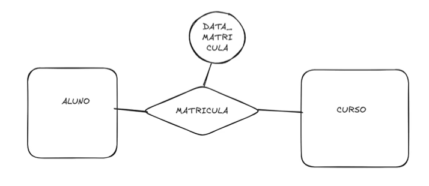

    * Atributo do relacionamento: data da matrícula, nota;
    * Representado por elipses ligadas ao losango;

  * Cardinalidade de Relacionamentos
    * Define quantos registros de uma entidade se associam à outra;
    * Tipos:
      * 1:1 => Um para um
        * Exemplo: O sistema não permite que uma pessoa tenha mais de um endereço associado a ela;
      * 1:N => Um para muitos
        * Exemplo: O sistema permite que uma pessoa tenha nenhum, um ou vários endereços associados a ela;
      * N:N => Muitos para muitos
        * Geralmente para esses casos busca se criar uma nova entidade, em vez de ter um relacionamento, e este vai relacionar as duas entidades
          * Tomando exemplo abaixo:
          
            

            * Várias pessoas podem estar matriculadas em vários cursos ou vários cursos podem ter várias pessoas matriculadas neles

### Chaves Primárias e estrangeiras

* Chaves Primárias
  * Compreender o papel da chave primária no banco de dados;
  * Identificar boas práticas na definição de chaves;
  * Diferencias chave natural e chave substituta;
  * Aplicar conceitos em exemplos práticos;

* O que é uma Chave Primária?
  * Um atributo (ou conjunto de atributos) que identifica unicamente cada tupla (linha) em uma tabela;
  * Não pode conter valores nulos;
  * Deve ser única em todos os registros;
  * Exemplo:
    * CPF, matrícula, ID_cliente

* Por que é importante?
  * Garante a integridadedos dados;
  * Permite buscas eficientes e atualizações seguras;
  * Base para relacionamentos entre tabelas (referência em chaves estrangeiras)
  * É usada para indexação automática em muitos SGBDs

* Critérios para uma Boa Chave Primária
  * Unicidade: Não se repete
  * Imutabilidade: Não deve mudar com o tempo;
  * Não nula: obrigatório para cada registro;
  * Estabilidade: Valor confiável ao longo do tempo;
  * Simplicidade: Idealmente curto e fácil de indexar;
  * Naturalidade ou substituição consciente

* Diagrama ER completo (curso_pessoa_endereco)
    

### Chave Natural vs Chave Substituta

* Chave Natural
  * Já existe nos dados reais;
  * Exemplo: CPF, email, matrícula escolar;;
  * Vantagens: significativa, fácil de entender;
  * Desvantagens: Pode mudar, nem sempre é única universalmente;

* Chave Substituta
    * Criada artificialmente pelo sistema (ex.: ID);
    * Exemplo:
      * id_aluno = 1,2,3...
    * Vantagens: Estabilidade, simplicidade, controle;
    * Desvantagens: Não tem significado para o usuário;

* Quando usar cada uma?
  * Chave Natural
    * Se for estável, curta e garantir unicidade;
  * Chave Substituta
    * Quando os dados naturais forem longos, instáveis ou sensíveis
    * Boa prática em sistemas complexos e integrados;

### Chaves Estrangeiras
* Um campo (ou conjunto de campos) que faz referência à chave primária de outra tabela;
* Estabelece relacionamentos entre tabelas;
* Garante a consistência dos dados;
* Exemplo: matricula_aluno na tabela Matricula faz referência à tabela Aluno

### Papel da Integridade Referencial
* Integridade referencial garante que não existam registros orfãos;
* Exemplo: Não é possível registrar uma matrícula de um aluno inexistente
* Banco de dados impede automaticamente inserções ou exclusões inválidas
* Fundamental para manter os dados coerentes e confiáveis

### Exemplo Prático

* Tabela: Aluno
  | id_aluno (PK) | nome      |
  | :------------ | :-------- |
  | 1             | Ana Souza |

* Tabela: Matricula
  | id_matricula | id_aluno (FK) | id_curso |
  | :----------- | :------------ | :------- |
  | 1001         | 1             | 202      |

### Restrições ON DELETE E ON UPDATE
* Permitem definir comportamentos automáticos quando o dado referenciado for alterado ou excluído;

* ON DELETE
  * RESTRICT - Impede a exclusão se houver dependência;
  * CASCADE - Apaga também os registros filhos;
  * SET NULL - Define valor nulo na FK;
  * NO ACTION - Comportamento padrão (erro se houver dependência);

* ON UPDATE
  * Mesmo raciocínio, mas para mudanças de chave primária;

## Normalização: Princípios Básicos
* Introdução à normalização

  ### Fluxo típico de projeto
  * Modelo conceitual
    * O quê o sistema precisa guardar, em termos de entidades, atributos e relacionamentos;
    * Geralmente representado por Diagramas de Entidade-Relacionamento (ER);
    * Serve para alinhar requisitos com Stalkeholders antes de pensar em tabelas ou tipos de dados;
    * Diagrama ER puro, sem pensar em tabelas, tipos de dados ou SGBD;

  * Modelo Lógico (Relacional)
    * Como organizar aquilo em relações (tabelas), definindo:
      * Tabelas e colunas
      * Chaves primárias e estrangeiras
      * Dependências funcionais e formas normais

    * aqui você já faz a normalização (1FN, 2FN, 3FN, ...) e obtém o Esquema Relacional.

  * Modelo Físico
    * Detalhamento de implementação no SGBD escolhido:
      * Tipos de dados específicos (VARCHAR, INT, DATE,...)
      * Índices, partições, tablespaces
      * Restrições avançadas (checks, triggers) e parâmetros de performance

    * Geração do DDL (CREATE TABLE, CREATE INDEX...)

  * Mapeamento do Modelo Conceitual para o Modelo Relacional
    * Nesta etapa é feita a transformação das entidades e relacionamentos do modelo ER para o modelo relacional, no qual os dados são representados por tabelas;
    * Estas regras garantem que o modelo relacional estará adequado alinhado com o modelo conceitual e sem inconsistências;
    * O resultado desta etapa é um diagrama de tabelas, contendo as tabelas, chaves primárias, chaves estrangeiras e restrições de integridade, formando assim o modelo lógico que servirá de base para o projeto físico do Bando de Dados;

  ### Formas Normais
  * Normalização
    * A normalização foi introduzida por E. F. Codd em 1970, baseado em um processo matemático formal fundamentado na teoria dos conjuntos;
    * Foi motivado em função de anomalias graves com relação à atualização, inclusão e deleção de elementos do modelo;
    * Com isso surgem as formas normais;
    * São tratamentos de decomposição de novas relações de forma a não se perder conteúdo e evitar os problemas nos tratamentos de informações nas tabelas;

      

    * O objetivo desse método é purificar gradativamente um conjunto de entidades e relacionamentos por outro, eliminando assim problemas que podem surgir, como:
      * grupos repetitivos de dados;
      * dependências parciais em relação a uma chave concatenada;
      * redundância de dados desnecessários;
      * perdas de informação, dificuldade na representação de fatos da realidade observada;
      * dependências transitivas entre atributos;

  * Dependênci Funcional
    * Uma dependência funcional é um relacionamento entre dois ou mais atributos de forma que o valor de um atributo identifique o valor para cada um dos outros atributos, ou seja, um atributo está relacionado a outro;
    * A -> B 
      * Atributo B é dependente (funcionalmente) do atributo A;
      * Isso significa que para descobrirmos o valor de B, preciso saber o valor de A;

  * Dependência Funcional Parcial
    * Ocorre quando os atributos não chave não dependem funcionalmente de toda a chave primária quando esta for composta;
    * Assim, nas tabelas onde a chave primária for composta, todos os atributos devem depender de toda a chave primária;
    * Caso a dependência seja de parte da chave, verificamos a existência de dependência funcional parcial;

  * Dependência Funcional Transitiva
    * Na definição dos campos de uma entidade podem ocorrer casos em que um campo não seja dependente diretamente da chave primária ou de parte dela, mas dependente de outro campo não chave da tabela e isto caracteriza a dependência funcional transitiva;

  * Dependência Funcional Multivalorada
    * Ocorre quando, para cada valor de um atributo A, há um conjunto de valores para os outros atributos B e C que estão associados a ele, mas são independentes entre si;

  ### 1FN - Primeira Forma Normal
  - Todos os atributos de uma tabela devem ser atômicos, ou seja, a tabela não deve conter grupos repetidos e nem atributos com mais de um valor;
  - Para deixar nesta forma normal, é preciso identificar a chave primária da tabela, identificar a(s) coluna(s) que tem dados repetidos e removê-la(s), criar uma nova tabela com a chave primária para armazenar o dado repetido e, por fim, criar uma relação entre a tabela principal e a tabela secundária;

    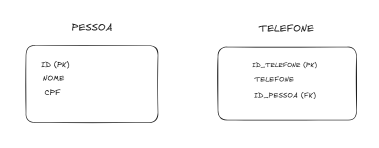

  ### 2FN - Segunda Forma Normal
  - A primeira coisa a ser observada é que para transformar uma tabela na segunda forma normal, ela já deve estar na primeira forma;
  - Todos os atributos não chaves da tabela devem depender unicamente da chave primária (não podendo depender apenas de parte dela);
    - Retiramos a possível chave (**CODIGO_DISCIPLINA**) a ser chave primária de uma tabela que já tinha chave primária (**tabela pessoa**)
    - Retirado o atributo (**DESCRIÇÃO_DISCIPLINA**) que estava ligado diretamente a chave **CODIGO_DISCIPLINA** e que não tinha realação diretamente com os atributos da tabela ao qual ela se encontrava
    - Chegando assim na 2º Forma Normal

      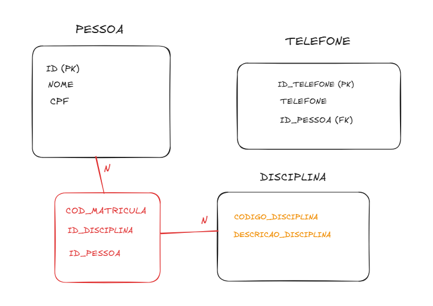

  ### 3FN - Terceira Forma Normal
  - A primeira coisa a ser observada é que para transformar uma tabela na terceira forma normal, ela já deve estar na segunda forma;
  - Além disso, os atributos não chave de uma tabela devem ser mutuamente independentes e dependentes unicamente e exclusivamente da chave primária (um atributo B é funcionalmente dependente de A se, para cada valor de A só existe um valor de B);
  - Para atingir essa forma normal, é preciso identificar as colunas que são funcionalmente dependentes das outas colunas não chave e extraí-las para outra tabela;

  - Ao fim destaas 3 etapas, chegamos ao seguinte consenso:
    - Todos os atributos são atômicos (1FN);
    - Todos os atributos não-chave dependem totalmente da chave primária (2FN);
    - Não existe transitividade em relação à chave primária(3FN);

  ### Forma Normal de Boyce-Codd (FNBC)
  - Forma normal que é um pouco mais 'forte' que a terceira forma normal;
  - Não é um requisito ncessário para atingir a quarta forma normal;
  - Destinada a lidar com situações em que se verifique a existência de mais do que uma chave candidata e que duas chaves candidatas possuam elementos comuns;
  - Uma relação está na BCFN quando todos os atributos estão dependentes da chave, de toda a chave e de nada mais do que a chave;
  - A 3Fn e a FNBC são muito próximas e normalmente, analisamos essas duas etapas de uma só vez;
  
    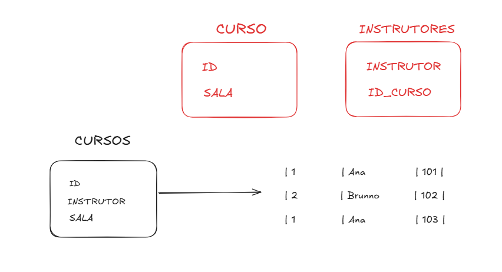

  ### 4FN - Quarta Forma Normal
  - Concerne em anomalias existentes na relação entre diferentes colunas da chave primária e só se aplica em tabelas com chaves primárias compostas por três colunas ou mais;
  - Para uma tabela estar na quarta forma normal, ela tem que primeiramente estar também na terceira forma normal;
  - A forma normal de Boyce-Codd não é necessária;

    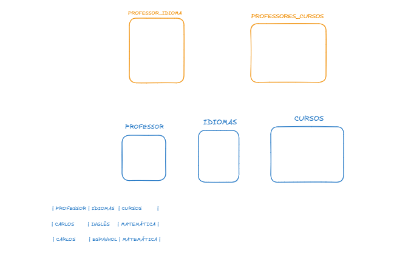

  ### 5FN - Quinta Forma Normal
  - Em termos mais simples, a 5FN garante que, ao unir as tabelas você não poderá obter informações adicionais que ainda não estejam disponíveis nas tabelas separadas.
  - É menos provável que ocorram dependências de união quando as tabelas já estão normalizadas (em 3FN OU 4FN), dai a dificuldade de criar um exemplo claro e direto para 5FN.


## Modelagem Relacional
* Regras de Integridade - Integridade de Identidade
  * A chave primária não pode conter valores nulos;
  * Como toda informação em um banco de dados relacional precisa ter uma identidade exclusiva, a chave primária deve ser obrigatoriamente preenchida;
  * Além disso, a chave primária não deve ter valores repetidos em uma tabela, de forma a garantir que exista apenas uma linha para cada valor definido para a chave primária;

* Regra de Integridade - Integridade Referencial
  * Se uma determianda tabela A possui uma chave estrangeira que estabelece relacionamento com uma tabela B, então o valor da chave estrangeira da tabela A deve ser igual ao valor da chave primária na tabela B;
  * Esta regra garante que as referências de uma tabela para outra tabela sejam válidas, de forma que os relacionamentos sejam consistentes e não ocorra a inconsistência nos dados;

* Regras de Integridade - Integridade de Domínio
  * Restringe o conjunto de valores que podem ser gravados em uma coluna de uma tabela;
  * Desta forma, somente os valores que pertencem ao domínio podem ser gravados na coluna da tabela;
  * Outros valores não são permitidos e a atualização é desfeita pelo gerenciador de banco de dados;

## Mapeamento do Modelo Conceitual para o Modelo Relacional

### Mapeamento das Entidades
  * Toda entidade torna-se uma tabela levando todos os atributos definidos na entidade que tornan-se colunas na tabela criada;
  * O identificador da entidade torna-se a chave primária da tabela que não permitirá repetição de valores e nem de valores nulos;

### Mapeamento de Atributos
  * Os atributos das entidades e dos relacionamentos devem ser gerados de forma que minimizem o consumo de espaço de armazenamento e torne mais eficiente a consulta de dados;
  * Devem ser escolhidos o tipo de dado e tamanho adequados para cada coluna criada na tabela;

### Regras  Gerais
  * Toda entidade vira uma relação;
  * Atributo identificador se torna chave primária na relação;
  * Atributros simples se tornam colunas (campos)
  * Atributos compostos tornam-se atributos simples, mapeados em colunas, uma coluna para cada atributo;
  * Atributos derivados não são mapeados;
  * Atributos multi-valorados podem ser mapeados de duas formas:
    * Como n colunas, onde n é o número máximo de valores do atributo;
    * Criando-se uma nova relação;


### Mapeamento de Relacionamentos
  * Relacionamentos que possuem atributos;
  * Estes relacionamentos se tornam tabelas no caso de relacionamentos n:n;
  * No caso de relacionamentos 1:n, os atributos do relacionamento são transferidos para a tabela que possui cardinalidade n;

  * Relacionamentos 1 para Muitos (1:N);
  * A entidade cuja cardinalidade é N recebe o atributo identificador da entidade com cardinalidade 1 que será mapeado como uma chave estrangeira na tabela criada para a entidade com cardinalidade N;

  * Relacionamentos 1 para 1 (1:1);
  * Uma das entidades envolvidas no relacionamento carrega o atributo identificador que deve ser definido como chave estrangeira na tabela criada para a entidade fazendo referencia à chjave primária da tabela criada para a outra entidade;

  * Relacionamento Muitos para Muitos (N:N);
  * Deve ser criada uma tabela que recebe os atributos identificadores das entidades que participam do relacionamento, sendo criada a chave primária composta pelas colunas derivadas dos atributos identificadores;

  * Relacionamentos Múltiplos;
  * Deve ser criada uma tabela que recebe tantos atributos identificadores quantas foram as entidades que participam do relacionamento. A chave primária desta tabela é composta por todos os atributos identificadores.
  
    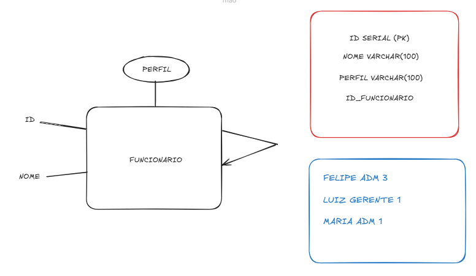

## Diagrama ER: Do papel ao banco de dados
* Criação de Diagramas ER
* Por que usar Diagramas ER?
  * Visualização clara da estrutura de dados
  * Comunicação entre analistasm desenvolvedores e stakeholders
  * Base para normalização e implementação no SGBD

* Ferramentas recomendadas
  * Draw.io (diagrams.net)
    * Gratuito, plugins para Confluence/GitLab.
    * Biblioteca ER e UML incorporada.
  * diagram.io
    * Foco em texto(DSL) que gera automaticamente
    * Exportação DDL para diversos SGBD's
  * Lucidchart
    * Colaboração em tempo real
    * Templates avançados e integração corporativas

* Outras opções
  * MySQL Workbench (reverse-engineering a partir do banco)
  * Microsoft Visio (empresa)
  * ERDPlus (academia/ensino)

### Convenções de Notação - Estilo Chen
* Retângulo: Entidade
* Retângulo com uma borda de linha dupla: Entidade fraca
* Retângulo com um losango dentro: Entidade associativa
* Oval: Atributo
* Oval com borda de linha dupla: Atributo multivalorado
* Oval com borda de linha pontilhada: Atributo derivado

* Losango: Relacionamento
* Losango com borda de linha dupla: Relacionamento fraco
* Linha reta: Relacionamento obrigatório
* Linha pontilhada: Relacionamento opcional
* Caracteres 1, N, M: Cardinalidade de relacionamentos um-para-um, um-para-muitos e muitos-para-muitos.

### Convenções de Notação - Pé de Galinha/Martin
* Semelhante à notação de Chen, o estilo pé de galinha representa entidades e relacionamentos como caixas e linhas;
* Ele se diferencia pela adição de formas diferentes no final das linhas para a cardinalidade do relacionamento;
* As formas são o anel(que significa zero), o traço(um) e o pé de galinha (muitos)
* Os usuários combinam essas formas para expressar a cardinalidade do realcionamento.

### Convenções de Notação - UML Simplificada
* Entidades como classes (caixas com três seções);
* Atributos e chaves na seção superior;
* Relacionamentos como linhas com multiplicidades (1,0...,1...);
* Uso de agregação/composição para relacionamentos fortes/fracos;

### Critérios de Escolha de Notação
* Nível de familiaridade da equipe;
* Complexidade do domínio;
* Necessidade de detalhamento (atributos vs. somente tabelas/colunas);
* Integração com outras metodologias (UML, DDD, BPMN);

### Boas Práticas der Representação
* Manter diagramas legíveis e organizados;
* Agrupar entidades relacionadas;
* Nomear entidades e relacionamentos de forma consistente;
* Indicar chaves primárias (PK) e estrangeiras (FK) claramente;
* Documentar pressupostos e regras de negócio;

## Exercícios - Criando o DER
* Um funcionário é alocado em um departamento e um departamento pode alocar um ou muitos funcionários.
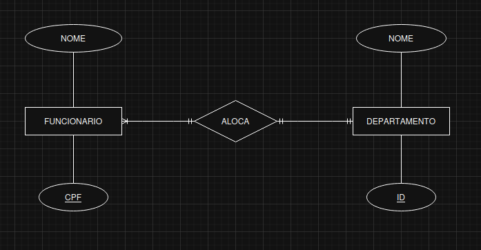

* Um pedido é composto por itens de pedido e cada item compõe apenas um pedido.
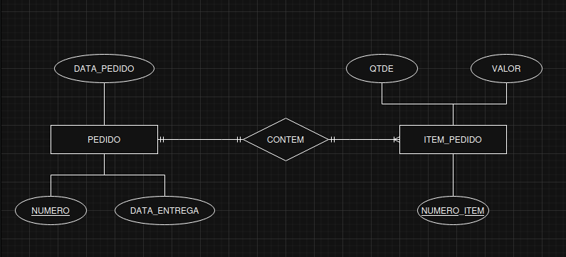

* Um projeto aloca muitos funcionários e muitos funcionários são alocados em um projeto em uma data.
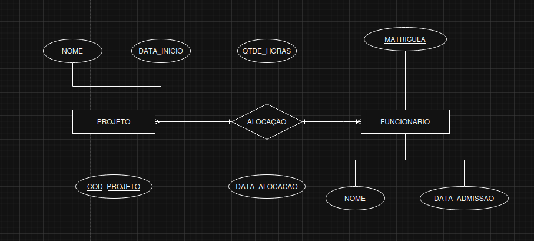

* DER
  * Um cliente tem um nome, cpf e endereço
  * Uma categoria possui um nome e código
  * Um produto possui um código, nome e preço.
  * Um pedido possui um número, data do pedido, status e endereço de entrega.
  * Por fim, um item do pedido possui a quantidade e um identificador.
  * Um cliente pode fazer no mínimo e no máximo um pedido, enquanto um pedido pode ser feito por muitos clientes ou nenhum cliente.
  * Uma categoria pode ser classificada em no mínimo e no máximo um produto, enquanto um produto pode ser classificado de diversas formas ou nenhuma vez.
  * Um produto referencia no mínimo e no máximo um item do pedido, enquanto um item do pedido pode ser ou não referenciado muitas vezes.
  * Um pedido é composto por no mínimo e no máximo um item de pedido, enquanto um item de pedido compõe um ou mais pedidos.
  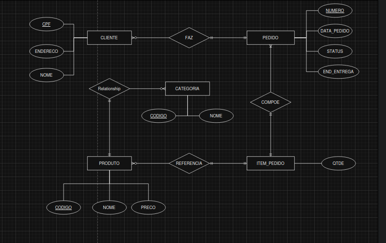

## Mapeamento ER para Modelo Relacional
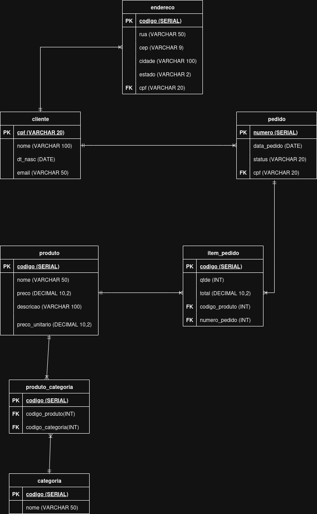

## Criando uma tabela
* Estrutura geral
```
CREATE TABLE esquema.tabela(
  coluna1 TIPO [CONSTRAINT ...],
  coluna2 TIPO [CONSTRAINT ...],
  ...
  [CONSTRAINT nome_constraint] PRIMARY KEY (coluna1, coluna2),
  [CONSTRAINT nome_constraint] FOREIGN KEY (colunaX) REFERENCES outra_tabela(colunaY)
)
```

## Tipos de Dados Comuns no PostgreSQL
* Númericos: SMALLINT, INTEGER, BIGINT, NUMERIC(precision, scale);
* Textuais: VARCHAR(n), TEXT, CHAR(n);
* Data e Hora: DATE, TIMESTAMP [WITHOUT|WITH] TIMEZONE;
* Identificadores: UUID, SERIAL / BIGSERIAL / GENERATED AS IDENTIFY;
* Outros: BOOLEAN, JSONB, BYTEA, ARRAY[...]

## Contraints de Coluna
* NOT NULL - garante o valor obrigatório;
* UNIQUE - valores distintos em toda a coluna;
* CHECK - condições customizadas;
* DEFAULT - valor padrão;
* COMMENT ON COLUMN - documentação inline;

## Chave Primária (PRIMARY KEY)
* Define unicidade e não nulidade
```
CONSTRAINT pk_tabela PRIMARY KEY(coluna1, coluna2)
```

## Chave Estrangeira (FOREIGN KEY)
* Integridade referencial
* Ações de ON DELETE / ON UPDATE: CASCADE, SET NULL, RESTRICT, NO ACTION
```
CREATE TABLE aluno_disciplina (
  aluno_id INTEGER,
  disciplina_id INTEGER,
  PRIMARY KEY(aluno_id, disciplina_id),
  FOREIGN KEY(aluno_id) REFERENCES aluno(id),
  FOREIGN KEY(disciplina_id) REFERENCES disciplina(id)
);
```

## Cardinalidades
* 1:1 (Um-para-Um)
* 1:N (Um-para-Muitos)
* N:N (Muitos-para-Muitos)

## Relacionamento 1:1
* Caracaterísticas e usos (ex.: Tabela auxiliar de perfil de usuário);
```
CREATE TABLE usuario (
  id BIGSERIAL PRIMARY KEY,
  nome TEXT NOT NULL
);

CREATE TABLE endereco (
  id BIGSERIAL PRIMARY KEY,
  usuario_id BIGINT UNIQUE,
  rua TEXT,
  CONSTRAINT fk_endereco_usuario
    FOREIGN KEY(usuario_id) REFERENCES usuario(id)
);
```

## Relacionamento 1:N
* Cenários típicos (ex.: cliente-pedidos)
```
CREATE TABLE cliente (
  id UUID PRIMARY KEY,
  nome TEXT NOT NULL
);

CREATE TABLE pedido (
  id BIGSERIAL PRIMARY KEY,
  cliente_id UUID NOT NULL,
  data DATE NOT NULL,
  CONSTRAINT fk_pedido_cliente
    FOREIGN KEY(cliente_id) REFERENCES cliente(id)
    ON DELETE SET NULL
)
```

## Relacionamento N:N
* Quando usar (ex.: alunos -disciplinas)
```
CREATE TABLE aluno (
  id BIGSERIAL PRIMARY KEY,
  nome TEXT NOT NULL
);

CREATE TABLE disciplina (
  id BIGSERIAL PRIMARY KEY,
  nome TEXT NOT NULL
)

CREATE TABLE aluno_disiplina (
  aluno_id BITINT NOT NULL,
  disciplina_id BIGINT NOT NULL,
  PRIMARY KEY(aluno_id, disciplina_id),
  FOREIGN KEY(aluno_id) REFERENCES aluno(id),
  FOREIGN KEY(disciplina_id) REFERENCES disciplina(id)
);
```

## Integridade e Performance
* Índices em chaves estrangeiras;
* Uso de ON DELETE CASCADExRESTRICT;
* Verificação de integridade via CHECK e NOT NULL;
* Impacto em JOINs e normalização;

## Padrões e Boas Práticas
* Nomeação consistente de constraints (fk_<tabela>_<referencia>);
* Documentação de relacionamentos no DDL (COMMENT ON CONSTRAINT ...);
* Evitar relacionamentos circulares;
* Monitorar cardinalidades reais e ajustar modelagem;

## Outras Features e Otimizações
* Índices: CREATE INDEX idx_nome ON tabela(coluna);
* EXCLUDE constraints para restrições geométricas ou customizadas;
* Schemas e tablespaces;
* Herança de tabelas (Postgres-specific);
* Partitioning (range, list, hash);