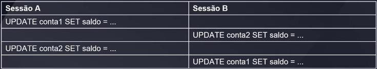

## Mini Projeto Gestão Educacional

### Descrição
* O sistema é uma plataforma de gestão educacional que centraliza o cadastro de escolas, turmas, disciplinas, professores e alunos;
* Nele, cada escola mantém suas turmas organizadas por código, turno e sala;
* Professores são vinculados às disciplinas que lecionam e têm seu histórico de admissão registrado;
* Alunos podem se matricular em diversas turmas, acompanhado de ínicio e término de cada disciplina;
* Endereços e telefones são tratados de forma estruturada, garantindo consistência nos dados de contato;
* Dessa forma, o sistema oferece visão integrada de toda a operação acadêmica, desde o ingresso do aluno até o planejamento de grade e alocação de docentes.

### Entidade principais
* Aluno (PK: matrícula) com nome, telefones (0-N) e endereço composto (rua, número, complemento);
* Escola (PK: CNPJ) com nome, telefones (0-N) e endereço composto;
* Turma (PK: código) com turno e salaDisciplina (PK: código) com nome, carga horária e ementaProfessor (PK: matrícula) com CPF, nome e telefones(1-N);
* Disciplina (PK: código) com nome, carga horária e ementa;
* Professor (PK: matrícula) com CPF, nome e telefones (1-N);

### Relacionanemtos
* Estuda: Aluno => Escola (1 Aluno em 1 Escola; 1 Escola com N alunos);
* Possui: Escola => Turma (1 Escola com N Turmas; 1 Turma em 1 Escola);
* Matrícula (associativa): Aluno <=> Turma (N:M, sem atributos próprios);
* Turma_Disciplina (associativa): Turma <=> Disciplina (N:M, com data_inicio e data_termino);
* Disciplica_Professor (associativa): Disciplina <=> Professor (N:M, sem atributos próprios);
* Trabalha: Professor => Escola (1 Professor em 1 Escola; 1 Escola com N Professores, com data_admissão);

## Consultas Avançadas (Tipo/sub-linguagens do SQL)

### Tipos/sub-linguagens do SQL
* A linguagem SQL(Structured Query Language) é composta por diferentes grupos de comandos, cada um destinado a um propósito específico no gerenciamento de um banco de dados relacional;
* Os principais "tipos"(ou sub-linguagens) da SQL: DDL, DML, DCL, TCL e DQL;
    * DDL - Data Definition Language (Linguagem de Definição de Dados)
      * DDL engloba os comandos responsáveis pela definição e estrutura do banco de dados. isso envolve criar, alterar e remover objetos como tabelas, índices, visões(views), esquemas(schemas), etc.
          * CREATE
              * Cria novos objetos (tabelas, índices, sequências, esquemas, views, funções, etc.)
                  ```
                  -- Criar tabela de usuários
                  CREATE TABLE usuarios (
                      id SERIAL PRIMARY KEY,
                      nome VARCHAR(100) NOT NULL,
                      email VARCHAR(150) UNIQUE NOT NULL,
                      data_cadastro TIMESTAMP NOT NULL DEFAULT NOW()
                  );
                  ```
        
          * ALTER
              * Altera a estrutura de um objeto existente.
              * Pode ser usado para:
                  * Adicionar/Remover/Modificar colunas.
                  * Ajustar restrições (constraints).
                  * Renomear objetos.
                      ```
                      -- Adicionar coluna "telefone" na tabela usuários
                      ALTER TABLE usuarios
                      ADD COLUMN telefone VARCHAR(20);

                      -- Modificar tipo da coluna "telefone" para CHAR(11)
                      ALTER TABLE usuarios
                      ALTER COLUMN telefone TYPE CHAR(11);

                      --Renomear a tabela "usuarios" para "clientes"
                      ALTER TABLE usuarios
                      RENAME TO clientes;
                      ```

          * DROP
              * Remove objetos do banco (tabelas, views, índices, esquemas, etc.)
              * Essa operação é irreversível (a menos que use backup ou "DROP...CASCADE" com cautela).
                    ```
                    -- Apagar a tabela clientes (e todos os dados nela)
                    DROP TABLE clientes;

                    -- Apagar a view "vw_vendas_mes" se ela existir
                    DROP VIEW IF EXISTS vw_vendas_mes;
                    ```

          * TRUNCATE
              * Remove todas as linhas de uma tabela, sem registrar individualmente cada linha para rollback.
              * É mais rápido que um DELETE sem WHERE.
              * Não remove a estrutura (colunas, restrições, índices), apenas zera os dados.
                ```
                -- Excluir rapidamente todos os registros da tabela "orders"
                TRUNCATE TABLE orders;
                ```

          * RENAME
              * RENAME TABLE usuarios TO clientes; --(em versões que suportam RENAME)
                ```
                RENAME TABLE usuarios TO clientes; --(em versões que suportam RENAME)
                ```

          * COMMENT
              * Adiciona ou altera comentários de descrição para objetos (tabelas, colunas, etc.), auxiliando na documentação interna do banco.
                ```
                COMMENT ON TABLE produtos IS 'Tabela que armazena informações dos produtos da loja';
                COMMENT ON COLUMN produto.price IS 'Preço de venda em reais (BRL)';
                ```


    * DML - Data Manipulation Language (Linguagem de Manipulação de Dados)
      * DML engloba os comandos que servem para inserir, atualizar, deletar e, em parte, selecionar os dados das tabelas. É o "corpo principal" das operações cotidianas de CRUD (CREATE, READ, UPDATE, DELETE);

      * INSERT
          * Insere novas linhas (tuplas) em uma tabela
            ```
            --Inserir um único registro
            INSERT INTO clientes (nome, email, data_cadastro)
            VALUES ('Ana Maria', 'ana.maria@example.com', '2024-05-30');

            -- Inserir múltiplos registros de uma vez
            INSERT INTO clientes (nome, email)
            VALUES
                ('Bruno Souza', 'bruno.souza@example.com'),
                ('Carla Lima', 'carla.lima@example.com');
            ```

      * UPDATE
          * Modifica valores de colunas para as linhas que satisfazem uma condição (WHERE).
          ```
          -- Alterar o email de um cliente específico
          UPDATE clientes
            SET email = 'ana.m.new@example.com'
          WHERE id = 1;

          -- Incrementar preço de todos os produtos em 10%
          UPDATE produtos
            SET price = price * 1.10;
          ```

      * DELETE
        * Remove linhas de uma tabela que satisfazem a condição (WHERE).
        * Sem cláusula WHERE, apaga todas as linhas(recomendado usar com cuidado ou em conjunto com transação).
            ```
            -- Remover cliente com determinado ID
            DELETE FROM clientes
            WHERE id = 42;

            -- Remover todos os pedidos CANCELADOS
            DELETE FROM orders
            WHERE status = 'CANCELLED';
            ```
      * UPSERT (INSERT ... ON CONFLICT)
        * Em PostgreSQL, o comando INSERT ... ON CONFLICT(...) DO UPDATE permite inserir ou, caso chave duplicada (conflict), atualizar o registro.
            ```
            INSERT INTO produtos (product_id, product_name, price)
            VALUES (10, 'Produto 10', 199.90)
            ON CONFLICT (product_id)
            DO UPDATE SET price = EXCLUDED.price;
            ```


    * DQL - Data Query Language (Linguagem de Consulta de Dados)
        * DQL refere-se ao comando SELECT e correlacionados (cláusulas WHERE, GROUP BY, HAVING, ORDER BY, JOIN, etc.). Serve para consultar/ler dados do banco, retornando conjuntos de resultados (result sets).
        * SELECT / FROM / WHERE / GROUP BY / HAVING / ORDER BY / LIMIT / OFFSET / JOINs (parte do DQL)
            ```
            SELECT coluna1, coluna2, ...
                FROM tabela
            [WHERE condicao]
            [GROUP BY colunas]
            [HAVING condicao_agrupamento]
            [ORDER_BY colunas [ASC|DESC]]
            [LIMIT n];
            ```

    * DCL - Data Control Language (Linguagem de Controle de Dados)
        * DCL envolve comandos relacionados ao controle de acesso e permissões no banco de dados. Serve para conceder (grant) ou revogar (revoke) privilégios de usuários/roles.
        * GRANT
          * Concede privilégios (permissões) sobre objetos (tabelas, views, sequences, etc.) ou até mesmo privilégios de sistema (ex.: criar banco, criar tabelas).
          * Pode atribuir permissões de leitura (SELECT), escrita (INSERT, UPDATE, DELETE), execução (EXECUTE em funções) e outras.
            ```
            -- Conceder permissão de SELECT E INSERT na tabela "produtos" ao role "vendedor"
            GRANT SELECT, INSERT ON produtos TO vendedor;

            -- Conceder pemissões de todas as ações (ALL PRIVILEGES) na base de dados "loja" ao role "admin_loja"
            GRANT ALL PRIVILEGES ON DATABASE loja TO admin_loja;

            -- Conceder permissão de USAGE em um schema
            GRANT USAGE ON SCHEMA relatório TO analista;
            ```
          
        * Revoke
          * Revoga privilégios anteriormente concedidos.
          * O uso de Revoke retira acesso a comandos específicos.
            ```
            -- Revogar permissão de DELETE  de "vendedor" sobre a tabela "produtos"
            REVOKE DELETE ON produtos FROM vendedor;

            -- Revogar todas as permissões de um role específico
            REVOKE ALL PRIVILEGES ON DATABASE loja from admin_loja;
            ```

    * TCL - Transaction Control Language (Linguagem de Controle de Transações)
        * TCL engloba os comandos que controlam o fluxo de transações no banco de dados, garantindo atomicidade, consistência, isolamento e durabilidade (ACID).
        * Permite confirmar (commit) ou desfazer (rollback) uma série de operações.

        * BEGIN (ou START TRANSACTION)
          * Inicia uma transação explícita.
          * A partir desse ponto, todas as operações DML (INSERT, UPDATE, DELETE) fazem parte de uma transação atômica.
            ```
            BEGIN;

            -- dentro da transação, várias operações:
            UPDATE contas SET saldo = saldo - 100.00 WHERE id = 1;
            UPDATE contas SET saldo = saldo + 100.00 WHERE id = 2;
            ```

        * COMMIT
          * Confirma definitivamente todas as alterações realizadas desde o último begin.
          * Após o COMMIT, as mudanças tornam-se permanentes e visíveis para outras transações.
            ```
            -- confirmar as alterações feitas
            COMMIT;
            ```

        * ROLLBACK
          * Desfaz todas as alterações realizadas desde o último BEGIN (ou desde o último ponto de salvamento).
          * Útil para garantir a integridade quando ocorre um erro ou condição inesperada.
            ```
            -- desfazer tudo que foi feito na transação
            ROLLBACK;
            ```

        * SAVEPOINT
          * Cria pontos intermediários dentro de uma transação que permitem rollback parcial até esse ponto, sem descartar tudo.
            ```
            BEGIN;

            -- OPERAÇÃO A
            INSERT INTO contas (cliente, saldo) VALUES ('Alice', 1000);

            SAVEPOINT sp1;

            -- OPERAÇÃO B (pode falhar)
            UPDATE contas SET saldo = saldo - 200 WHERE cliente = 'Bob';

            -- se OPERAÇÃO B falhar, podemos voltar apenas a sp1
            ROLBACK TO SAVEPOINT sp1;

            -- continuar a transação
            INSERT INTO contas (cliente, saldo) VALUES ('Carlos', 500);

            COMMIT;
            ```

        * SET TRANSACTION
          * Define propriedades de transação, como nível de isolamento (READ COMMITED, REPEATABLE READ, SERIALIZABLE).
            ```
            SET TRANSACTION ISOLATION LEVEL REPEATABLE READ;
            ```

    * Pontos importantes
      * Conhecer cada categoria de comandos SQL - DDL, DML, DQL, DCL e TCL - é fundamental para projetar, manipular, consultar, proteger e manter a integridade dos dados de forma robusta.

### Subconsultas no WHERE
* Consulta interna que retorna um conjunto de valores utilizado como critério de filtro na cláusula WHERE
  ```
    SELECT ...
    FROM tabela_principal
    WHERE coluna_principal IN (
      SELECT coluna_secundaria
      FROM tabela_secundaria
      WHERE condicao
    );
  ```

### Uso de EXISTS e NOT EXISTS
* Testa a existência (ou não) de linhas retornadas por uma subconsulta correlacionada.
  ```
    SELECT ...
    FROM tabela_principal tp
    WHERE EXISTS (
      SELECT 1
      FROM tabela_secundaria ts
      WHERE ts.chave = tp.chave
    );
  ```

### Diferença entre IN e EXISTS
* IN: Compara a coluna com um conjunto de valores estáticos retornados por uma subconsulta não correlacionada (bom para listas pequenas)
* EXISTS: Percorre a consulta correlacionada linha a linha e retorna TRUE/FALSE na primeira ocorrência, geralmente eficiente em grandes volumes de dados.

### Quando usar cada um?
* EXISTS: É ideal quando queremos saber se há pelo menos um registro relacionado (sem precisar comparar valores exatos).
* IN: É mais intuitivo quando filtramos contra valores literais ou o conjunto retornado é pequeno e estático.


## Relacionamento e Junções (Sintaxe básica de INNER JOIN)
* A sintaxe padrão para conectar duas tabelas em que se deseja apenas as linhas que tenha correspondência em ambas é:
  ```
    SELECT a.*, b.*
    FROM tabela_a AS a
    INNER JOIN tabela_b AS b
      ON a.chave = b.chave;
  ```

### Uso de aliases (a, b)
* Aliases (apelidos) simplificam a escrita e a leitura quando as tabelas tem nomes longos:
  ```
    SELECT c.first_name, o.order_date,
      FROM customers AS c
      INNER JOIN orders AS o
        ON c.customer_id = o.customer_id;
  ```

## JOIN

### INNER JOIN
* É um tipo de junção em SQL que retorna apenas as linhas que possuem correspondência em ambas as tabelas envolvidas na consulta, ou seja, busca combinar registros de duas (ou mais) tabelas com base em uma condição de igualdade (geralmente entre chaves relacionadas)
* Se não houver correspondência, a linha não aparece no resultado.

### LEFT JOIN (Também chamado de LEFT OUTER JOIN)
* É um tipo de junção SQL que retorna todas as alinhas da tabela esquerda e as linhas correspondentes da tabela da direita(quando há correspondência)
* Se não houver correspondência, os valores da tabela da direita vêm como **NULL**
  ```
  SELECT ...
    FROM tabela_a AS a
    LEFT JOIN tabela_b AS b
      ON a.chave = b.chave;
  ```

### RIGHT JOIN (Também chamado de RIGHT OUTER JOIN)
* Retorna todas as alinhas da tabela da direita e apenas as linhas correspondentes da tabela da esquerda.
* Se não houver correspondênica, os valores da tabela da esquerda aparecem como **NULL**
  ```
  SELECT ...
    FROM tabela_a AS a
    RIGHT JOIN tabela_b AS b
      ON a.chave = b.chave;
  ```

### FULL JOIN (Também chamado de FULL OUTER JOIN)
* Combina o comportamento do **LEFT JOIN** e do **RIGHT JOIN**
* Retorna as correspondências entre eles quando existirem
* Preenche com **NULL** quando não há correspondência em uma das tabelas
  ```
  SELECT ...
    FROM tabela_a AS a
    FULL JOIN tabela_b as b
      ON a.chave = b.chave;
  ```

### Coalesce
* É uma função SQL usada para tratar valores NULL
* Ele retorna o primeiro valor não nulo em uma lista de argumentos

### Filtros Pós-Junção e Precedência
* É preciso ter cuidado ao usar algumas claúsulas, pois, isso pode acabar limitando o uso, por exemplo, de um LEFT JOIN, resultando em um join somente, como um INNER JOIN, saindo totalmente do próposito de toda a consulta criada.
  ```
  SELECT *
  FROM products AS p
  LEFT JOIN order_items AS oi
    ON p.product_id = oi.product_id
  WHERE oi.quantity > 10;
  ```

* Para corrigir essa questão podemos fazer da seguinte forma:
  ```
  SELECT *
  FROM products AS p
  LEFT JOIN order_items AS oi
    ON p.product_id = oi.product_id
  AND oi.quantity > 10;
  ```

## Subconsultas Correlacionadas vs. Não Correlacionadas

### Subconsulta Não Correlacionada
* Executa a subconsulta somente uma vez, retornando um conjunto de valores fixo para uso WHERE ou outra cláusula:
  ```
  SELECT product_id, product_name
    FROM products
  WHERE price > (
    SELECT AVG(price) FROM products
  );
  ```

### Subconsulta Correlacionada
* A subconsulta faz referência a colunas da consulta externa e é reexecutada para cada linha resultante:
  ```
  SELECT
    c.customer_id,
    c.first_name,
    c.last_name
    (
      SELECT COUNT(*)
        FROM orders o
        WHERE o.customer_id = c.customer_id
    ) AS total_pedidos
  FROM customers AS c;
  ```

### Diferenças de performance
* Subconsulta não correlacionada pode ser materializada uma vez; Geralmente é mais rápida.
* Subconsulta correlacionada costuma ser lenta em grandes volumes, pois executa N vezes (onde N = número de linhas da consulta externa).


## Consultas com múltiplas tabelas (juinções em Três ou Mais Tabelas com condição adicional)
### Exemplo envolvendo 4 tabelas
* Tabelas
  * clientes => armazena dados do cliente
  * pedidos => contém o cabeçalho do pedido (inclui cliente_id)
  * itens_pedido => contém cada produto dentro de um pedido (inclui pedido_id e produto_id)
  * produtos => lista de produtos disponíveis

### Exemplo complexo envolvendo 4 tabelas
* Estratégia de junções encadeadas
  * Primeiro, conectar clientes a pedidos via cliente_id
  * Depois, conectar pedido a itens_pedido via pedido_id
  * Finalmente, conectar itens_pedido a produtos via produto_id
  * Aplicar filtro em umda das tabelas intermediárias
  * Se quisermos apenas pedidos com status = 'ENTREGUE' podemos colocar a condição na cláusula WHERE (após a junção), pois estamos usando INNER JOIN em todas:
  ```where pd.status = 'DELIVERED'```

## Subqueries
* É uma consulta SQL inserida dentro de outra consulta principal(query externa), geralmente utilizada para fornecer um valor ou conjunto de valores que serão usados como critério de filtragem, comparação ou agregação.

### Quando usar subqueries?
  * Filtrar dados com base em critérios dinâmicos
  * Realizar comparações com valores calculados
  * Executar agregações intermediárias
  * Reutilizar lógica de consulta
  * Reduzir a complexidade da lógica com CTEs ou JOINs alternativos

  <br>

  | Tipo | Descrição | Retorno | Exemplo de uso |
  |------|-----------|---------|----------------|
  | Scalar | Retorna um único valor (linha e coluna) | 1 linha x 1 coluna | Comparações (=, <, >, etc.) |
  | Column | Retorna uma coluna com vários valores | N linhas x 1 coluna | IN, NOT IN |
  | Row | Retorna uma linha com várias colunas | 1 linha x N colunas | Comparações com tuplas |
  | Table | Retorna múltiplas linhas e colunas (tabela virtual) | N linhas x N colunas | Utilizada em EXISTS, IN, JOIN |


## Conceitos básicos de CTEs

  ### Introdução as CTEs
  * CTE (Common Table Expressions) é uma subconsulta nomeada temporária que pode ser referenciada dentro da query principal.
  ```
    WITH nome_cte AS (
      SELECT ...
    )
    SELECT * FROM nome_cte;
  ```

  ### Vantagens
  * Legibilidade: facilita a leitura de consultas longas;
  * Reuso: Reutiliza resultados intermediários se duplicar lógica;
  * Modularização: Divide uma consulta complexa em blocos;
  * Recursividade: Permite percorrer hierarquias (em WITH RECURSIVE)

  ### Quando usar
  * Consultas com múltiplos passos
  * Agregações intermediárias reutilizadas
  * Consutlas recursivas (ex.: estrutura de gerência, encadeamento de categorias, etc.)

## CTE Não-Recursiva vs. Recursiva
| Tipo de CTE | Descrição |
|-------------|-----------|
| Não-Recursiva | Executada apenas uma vez, como uma subconsulta nomeada |
| Recursiva | Executada repetidamente, chamando a si mesma até uma condição de parada |

* Não-recursiva é útil para modularizar as etapas da consulta, especialmente em análises mais agregadas, com várias tabelas e junções
* Recursiva é mais indicada quando temos relações hierarquicas ou sequenciais, como árvores de categorias, uma estrutura organizacional ou um cálculo de somas progressivas

## Operações de Conjunto em SQL

  ### O que são?
  * As operações de conjunto em SQL servem para combinar os resultados de duas ou mais consultas com a mesma estrutura de colunas.

  ### Resumo de Operações
  | Operador | Descrição |
  |----------|-----------|
  | UNION | Une os resultados de duas consultas eliminando duplicatas |
  | UNION ALL | Une os resultados de duas consultas mantendo as duplicatas |
  | INTERSECT | Retorna apenas os registros comuns entre as consultas |
  | EXCEPT | Retorna registros na primeira consulta que não aparecem na segunda |

  

  <br>

  | Operador | Combina dados? | Remove duplicatas? | Traz intersecção? | Traz diferença? |
  |----------|----------------|--------------------|-------------------|-----------------|
  | UNION | Sim | Sim | Não | Não |
  | UNION ALL | Sim | Não | Não | Não |
  | INTERSECT | Não | Sim | Sim | Não |
  | EXCEPT | Não | Sim | Não | Sim |

## UNION - Une eliminando as duplicatas
* o UNION combina os resultados de duas ou mais consultas e remove os registros duplicados do resultado final;
* Os conjuntos devem ter o mesmo número de colunas;
* Os tipos de dados devem ser compatíveis (por posição);
* A ordenação final deve ser feita fora do UNION;

## INTERSECT - Interseção entre os conjuntos
- O INTERSECT retorna apenas os registros que estão presentes em ambas as consultas;
- Remove duplicatas do resultado;
- Pode ser usado para verificar a coincidência de dados;

## Window function (Conceito de função de Janela)
* São funções que calculam valores sobre um conjunto de linhas relacionadas, mantendo o detalhe de cada linha;
* Diferente de GROUP BY, não colapsam os dados: os detalhes individuais permanecem, e os cálculos são feitos "por cima";

  ### Vantagens
  * Permitem calcular médias, totais, rankings e contagens sem perder o contexto da linha;
  * Muito úteis para rankings, comparações, cumulativos, percentuais, etc;
  * Utilizam a cláusula OVER(...) para definir a janela de cálculo;
  
  ```
    FUNCAO_DE_JANELA() OVER(
      [PARTITION BY coluna_de_divisão]
      [ORDER BY coluna_de_ordenação]
    )
  ```

  ### ROW_NUMBER

  * Atribui um número sequencial único para cada linha dentro de uma partição;
  * Sempre sequencial: 1, 2, 3, ...;
  * Ignora empates nos valores ordenados;

  ### RANK()
  * Atribui um número de ranking, com buracos em empates;
  * Se duas linhas estão empatadas em 1º, a proxíma será de 3º(pula o 2º);
  * Ideal para ranking com posições visuais reais;

  ### DENSE_RANK()
  * Semelhante ao RANK(), mas sem buracos nos empates;
  * Se duas linhas estão empatadas em 1º, a próxima será 2º(sem pular);
  * Ideal para ranking contínuo com pontuações iguais;


  ### Comparação Visual
  * Suponha os pedidos abaixo de um cliente:

    | order_id | total_amount | ROW_NUMBER() | RANK() | DENSE_RANK() |
    |:---:|:---:|:---:|:---:|:---:|
    | 1 | 1000.00 | 1 | 1 | 1 |
    | 2 | 1000.00 | 2 | 1 | 1 |
    | 3 | 800.00 | 3 | 3 | 2 |
    | 4 | 500.00 | 4 | 4 | 3 |
  
  ### Funções de Deslocamento (LAG E LEAD)
  * O que são?
    * Funções de janela que permite acessar valores de outras linhas relativas à linha atual, sem perder o detalher linha a linha.

  * Para que servem?
    * Comparações sequenciais
    * Análises de tendência (ex.: vendas por mês)
    * Identificação de variações, evolução ou regressão

    ### Sintaxe
    ```
      LAG(coluna, deslocamento, valor_padrão) OVER (
        PARTITION BY ...
        ORDER BY ...
      )

      LEAD(coluna, deslocamento, valor_padrão) OVER (
        PARTITION BY ...
        ORDER BY ...
      )
    ```

## Otimização e Perfomance

  ### Índices: quando e como usar

  ### O que são?
  * Estrutura auxiliar que acelera buscas, ordenações e junções, montada a partir de uma ou mais colunas de uma tabela

  ### Benefícios
  * Reduz custo de varredura completa (seq scan) para buscas pontuais ou intervalos
  * Melhora performance de consultas WHERE, JOIN, ORDER BY E GROUP BY

  ### Custos
  * Uso de espaço em disco/memória
  * Sobrecarga em INSERT/UPDATE/DELETE (cada operação de escrita também atualiza índices)
  
  ### Sintaxe de criação
  * CREATE INDEX
    ```
      CREATE INDEX [CONCURRENTLY] nome_de_indice
        ON tabela [USING método] (coluna1 [ASC|DESC], coluna2, ...)
    ```

  * CREATE UNIQUE INDEX:
    ```
      CREATE UNIQUE INDEX nome_indice_unico
        ON tabela(coluna);
    ```

  ### Árvores B-Tree vs. Hash vs. GiST vs. GIN

    ### B-Tree (padrão)
    * Equilíbrio ótimo para busca de igualdade e intervalo (BETWEEN, >, <)
    
    ### Hash
    * Otimizado apenas para igualdade (=)
    * Não suporta buscas por intervalo

    ### GiST (Generalized Search Tree)
    * Permite índices sobre tipos geométricos, arrays, texto completo
    * Suporta operações "aproximadas" (p.ex. índice de similaridade)
    
    ### GIN (Generalized Inverted Index)
    * Ideal para colunas com múltiplos valores (arrays, JSONB)
    * Mantém um "inverted list" de valores => rápido para existência de elemento

  ### Como o PostgreSQL armazena e pesquisa em um índice
  * Armazenamento
    * Cada índice é uma tabela interna (pg_class) com páginas de dados organizadas em nós folha e não-folha (no B-Tree)

  * Pesquisa
    * PostgreSQL usa o planner para escolher entre seq scan e index scan
    * Em index scan, busca-se nas páginas raiz => páginas folhas => retorna tupplas correspondentes

  ### Escolha e criação de índices / Monitoramento e manutenção de índices

    ### Custo de leitura vs. custo de escrita
    * Leitura: índices diminuem I/O de leitura para buscas seletivas
    * Escrita: todo INSERT/UPDATE/DELETE que afete a coluna indexada gera manutenção extra no índice, impactando throughput
    * Trade-off: Quanto maior o número de índices, maior a penalidade em escritas

    ### Índices únicos vs. não-únicos
    * Não-único(default): CREATE INDEX idx_products_price ON products(price)
    * Único: garantia de unicidade em coluna(s):

      ```
        CREATE UNIQUE INDEX idx_customers_email
          ON customers(email);

        create unique index idx_department_name_unq
          in departments(department_name)
      ```

    * Não-único(preço, repetido em muitos produtos):
      ```
        CREATE INDEX idx_produtos_category
          ON products(category_id);
      ```


  ### Índices parciais e expressões indexadas
    * Parciais: Indexa apenas subset de linhas, reduzindo tamanho e custo de manutenção
      * So indexar pedidos pendentes, reduzindo tamanho:
    ```
      CREATE INDEX idx_orders_pending
        ON orders(order_date)
        WHERE status = 'PENDING'
    ```

    * Expressão: Indexa o resultado de uma expressão qualquer.
    ```
      -- Busca case-sensitive em email
      CREATE INDEX idx_customers_lower_email
        ON customers (LOWER(email));
    ```

    * Lower-case search em e-mail:
      ```
        CREATE INDEX idx_customers_lower_email
          ON customers (LOWER(email))

        EXPLAIN ANALYZE
        select *
        from customers
        where lower(email) LIKE '%@example.com'
      ```

  ### EXPLAIN E ANÁLISE DE PLANOS DE EXECUÇÃO
    * O que é?
      * A ferramenta EXPLAIN ANALYSE desempenha um papel crucial na otimização e eficiência das consultas SQL;
      * É um comando SQL usado para analisar o plano de execução de consultas SQL;

    * Quando usar?
      * Análise de Desempenho de Consultas
      * Otimização de Consultas
      * Indexação Eficaz
      * Depuração

    ### Sintaxe
    ```
      explain analyse select * from customers
      where customer_id = 101;
    ```

  ### Explain - Leituras Avançadas de Planos
  * Index Scan
    * Utilizado para quando se é trabalhado em cima de um índice
    * Muitas vezes quando trabalhamos com tabelas que tem poucos registros e não tem a necessidade de utilizar index no momento da execução do comando, o próprio Postgres entende que não é necessário, desta forma, é ativado o Seq Scan, que seria uma consulta normal, sem estar trabalhando com índice no momento e acaba não retornando o índice para nós 
    * Para forçar o resultado do explain analyse 'em cima' de um index scan, é preciso desabilitar temporariamente o seq scan:
    
      ```
        set enable_seqscan = off;

        explain analyse
        select * from products where price > 300;

        -- Depois reativa o seqscan
        set enable_seqscan = on;
      ```

  ### Otimizando com pré-agregação

  * Técnica para melhorar a performance de consultas que envolvem joins com grandes volumes de dados
  

  ### Particionamento de Tabelas e Dados no PostgreSQL

  * ### Particionamento de dados
  
    * Particionamento de dados é o recurso no qual o adminsitrador de banco de dados poderá ter o domínio dos locais onde seus dados são armazendos.
    * Resulta em gerenciamento melhor dos dados, em uma melhor performance, ter um melhor acompanhamento de como está ocorrendo a participação do file group e como que esses registros estão alocados.
    

    ### Partition By Range
    * Divide dados em faixar contínuas de valores (datas, númericos,...;)
    * Quando usar: séries temporais, logs, ordens por data.


    ### Demais tipos de particionamento de tabelas
    * Range
    * List
      * Baseado em conjuntos discretos de valores
      * Ideal para categorização
        * Coluna do tipo status, aonde a pessoa pode ser gerente, administrador, funcionário, fornecedor...
        * Coluna do tipo estado/região (Ex.:São Paulo, Rio de Janeiro, Curitiba, Florianópolis ou ainda Região Sul, Sudeste, Norte, Nordeste...)
    * Hash
      * Valor hash da chave, ou seja, quando não há um agrupamento lógico natural, usamos um hash (um valor de uma chave) para ser como base e fazer o agrupamento baseado nessa escolha
      * 
    * Default
      * Default é mais genérico, pega os valores que não se encaixam em valor algum.
      * Caso não tenha conseguido categorizar as tabelas, 'pega' faz o default adiciona todos os dados, para deixar uma participação separada assim, sem muita organização.

    ### Normalização vs. denormalização: Equilibrando Performance

      * Princípios de normalização

      ### Formas Normais
      * 1FN: cada coluna armazena valor atômico
      * 2FN: além da 1FN, todas as colunas não-chave dependem da chave completa (sem dependências parciais)
      * 3FN: afém da 2FN, não existem dependências transitivas entre colunas não-chave

      ### Benefícios da normalização
      * Integridade referencial garantida por chaves estrangeiras
      * Eliminação da redundância: evita dados duplicados e inconsistentes
      * Facilidade de manutenção: alterações em um único lugar

      ### Desvantagens em cenários análiticos
      * Múltiplos JOINs: consultores OLAP que agregam dados em grandes volumes sofrem com o custo de junções
      * Latência: Leitura de várias tabelas pode ser mais lenta que leitura de uma única tabela ampla
    
      ### Casos de uso de denormalizacao
      * Mostrar quando e como sacrificar parte da normalização para ganhar rapidez de leitura
      
      ### Colunas calculadas e agregados pré-computados
      * Coluna calculada (computed/generated column) no próprio registro:
      
        ```
          alter table pedidos
            add column valor_total numeric(12, 2)
          generated always as (
            (
              select sum(quantidade * preco_unit)
              from itens_pedido i where i.pedido = pedidos.pedido_id
            )
          ) STORED;
        ```
        * Acima estamos alterando a tabela pedidos, adicionando uma nova coluna esta será gerada através do comando generated, definindo assim a mesma como uma coluna computada, aonde os seus valores serão gerados apartir de um select e assim colocados na coluna.
        * Vantagem: Leitura direta, não é necessário realizar nenhum JOIN
        * Desvantagem: Custo extra na hora da escrita, no momento da escrita, ela sempre fará o select.
      
      ### Tabelas de resumo (summary tables)
      * Tabela dedicada que armazena agregados:
        ```
          create table resumo_vendas_mensal (
            ano         int,
            mes         int,
            valor_venda numeric(14, 2),
            primary key (ano, mes)
          );

          -- Popula a tabela inicialmente
          insert into resumo_vendas_mensal(ano, mes, valor_venda)
          select
            extract(year from p.data_pedido)::int as ano,
            extract(month from p.data_pedido)::int as mesm
            sum(i.quantidade * i.preco_unit)
          from pedidos p
          join itens_pedido i on i.pedido_id = p.pedido_id
          group by 1, 2
        ```

      ### Estratégias híbridas e boas práticas
      * Definir critérios para combinar normalização e denormalização sem perder controle de integridade.
      * Quando normalizar vs. quando denormalizar
      
        | Cenário | Normalização | Denormalização |
        | :---: | :---: | :---: |
        | Alto volume de transações (OLTP) | Prioritário | Evitar |
        | Consultas análiticas frequentes | Aceitável (JOINs) | Recomendo |
        | Atualização em tempo real | Melhor (menos redundância) | Cuidado com inconsistências |
        | Tolerância a leve latência nas escritas | Sim | Não |
  

      ### Ferramentas de sincronização

      * Triggers: para updates/inserts/deletes em tabelas fonte;
      * Jobs periódicos (cron, pg_cron, ferramentas de ETL): para refresh de materialized views ou rebuild de summary tables durante as janelas de baixa carga;
      * Streaming/CDC (Logical Replication, Debezium): manter réplicas análiticas quase em tempo real;

## Recursos Avançados do Postgres
* Views e tabelas temporárias
  
  ### View
  * A view pode ser definida como uma tabela virtual composta por linhas e colunas de dados vindos de tabelas relacionadas em uma query (um agrupamento de SELECT's, por exemplo)
  * Simplificação de consultas complexas
  * Encapsulamento de lógica de negócio
  * Segurança: export apenas colunas permitidas

    #### Tipos de views
    * Simples (não atualizáveis)
      * Normalmente envolve Joins ou agregações
      * Não pode ser atualizada diretamente
      * views basicamente criadas para consultas

    * Atualizáveis (quando atendem às regras de atualizabilidade)
      * Se baseia em apenas uma tabela
      * Não contém o uso do:
        * distinct, do group by, do having, do limit
        * Funções de agregação como: count, sum, etc.
        * Junções, Joins, subqueries no select
      * Todas as colunas da view são diretamente mapeàveis à tabela base, ou seja, é basicamente um select simples que pegamos naquela tabela e então, cosnegue fazer atualização

      * Exemplo prático - Criando uma View simples
        ```
          -- View que lista produtos com categorias e preço acima de R$200
          create view vw_produtos_caros as
          select
            p.produto_id,
            p.product_name,
            c.category_name,
            p.price
          from produtos p
          join categories c on p.category_id = c.category_id
          where p.price > 200;
        ```

  ### Views e tabelas temporárias - Materialized Views e Performance

    #### O que é uma Materialized View?
    * Uma materialized View é uma view que armazena dados fisicamente no banco, ou seja, ela salva o resultado da sua consulta em disco.
    
    #### Vantagens e Desvantagens
    |  |  |
    | --- | --- |
    | **Vantagem** | **Explicação** |
    | ⚡ Performance | Muito mais rápida para consultas pesadas e repetidas |
    | 🔄 Ideal para relatórios | Quando os dados não mudam a todo momento |
    | ✅ Indexável | Você pode **criar índices** sobre materialized views |

    |  |  |
    | --- | --- |
    | **Desvantagem** | **Explicação** |
    | 🚫 Dados desatualizados | A view **não reflete automaticamente** alterações nas tabelas base |
    | 🔄 Requer manutenção | É preciso usar REFRESH MATERIALIZED VIEW para atualizar os dados |

    #### Criando um Materialized View
    * Exemplo: Resumo mensal de vendas (como feito na aula anterior)
      ```
        create materialized view
        mv_resumo_vendas_mensal as
        select
          date_trunc('month', o.order_date) as mes,
          count(o.order_id) as total_pedidos,
          sum(o.total_amount) as valor_total
        from orders o
        group by 1;
      ```

    #### Conceitos fundamentais - Tabelas temporárias
    * O que são?
      * São tabelas criadas para uso temporário, ou seja, existem apenas durante a sessão ou transição atual e são automaticamente descartadas ao final.
    
    #### Tipos de Tabelas Temporárias
    |  |  |  |  |
    | --- | --- | --- | --- |
    | **Tipo** | **Duração** | **Persistência** | **Usos recomendados** |
    | TEMP ou TEMPORARY | Até o fim da sessão | 🚫 Não persiste | Cálculos temporários, ETL |
    | UNLOGGED | Persistente (Até reinício do servidor) | ✅ Mas **não registrada no WAL** | Melhor performance, mas sem recuperação em falhas |

    #### Vantagens das tabelas temporárias
    * Evita repetição de subconsultas ou joins pesado;
    * Exita a criação de tabelas permanentes desnecessárias;
    * Auxilia em ETL, relatórios parciais, comparações entre períodos, etc;
    * Pode melhorar a performance de pipelines analíticos complexos;


    #### Criar e Popular uma Tabela temporária
      ```
        -- Cria tabela temporária de vendas do mês de junho/2024

        create temporary table tmp_pedidos_junho
        as
        select *
        from orders
        where order_date between '2024-06-01' and '2024-06-30';
      ```

  ### Views e tabelas temporárias - Casos de uso combinados e boas práticas

    #### O que é ETL?
    * ETL = Extract, Tranform, Load

    |  |  |  |
    | --- | --- | --- |
    | **Etapa** | **Descrição** | **Exemplo no PostgreSQL** |
    | Extract | Extrair dados das tabelas principais | select * from orders |
    | Transform | Limpar, filtrar ou agregar dados | create temp table, join, group by |
    | Load | Armazenar em uma estrutura de destino (relatório, tabela final, etc.) | insert into, create view, exportação |

    #### Fluxo combinado: Views + Tabelas temporárias
    * 🔄 Situação: Você precisa gerar relatórios trimestrais de um grande volume de dados de 2024
    
      ```
        create temporary table tmp_vendas_2024 as
        select *
        from orders
        where order_date >='2024-01-01';
      ```

    #### Boas práticas ao combinar Views e Tabelas Temporárias

    |  |  |
    | --- | --- |
    | **Boas práticas** | **Por que fazer?** |
    | 🧪 Use temp table para filtros pesados | Evita escanear a tabela original várias vezes |
    | 🧠 Encapsule lógica em views nomeadas | Evita escanear a tabela original várias vezes |
    | 🔎 Use explain analyse nas consultas finais | Verifica se índices estão sendo usados corretamente |
    | 🧹 Lembre-se: views não armazenam dados | O select ainda consulta a origem a cada execução |
    | ⚡ use materialized view para dados que mudam pouco | Aumenta a performance com cache físico |


    #### Resumo final
    |  |  |  |
    | --- | --- | --- |
    | **Recurso** | **Ideal para** | **Características** |
    | temp table | Cálculos intermediários | Só existe durante a sessão |
    | view | Encapsular lógica fixa | Executa o select a cada uso |
    | materialized view | Relatórios pesados com dados estáticos | Armazena os dados fisicamente |


## Introdução a funções em PL/pgSQL

  ### O que é PL/pgSQL?
  * PL/pgSQL (PL => Procedural Language | PostgreSQL => Structured Query Language) é a lingugagem procedural nativa do PostgreSQL usada para escrever funções, procedures, triggers e blocos anônimos com controle de fluxo, variáveis, loops e tratamento de exceções.

  * O que ela permite fazer (que o SQL padrão não faz):
    * Variáveis locais (DECLARE);
    * Condições (IF, CASE);
    * Loops (FOR, WHILE, LOOP);
    * Tratamento de exceções (EXCEPTION);
    * Execução de blocos de código (BEGIN... END);
    * Reuso de lógica com maior legibilidade;

  ### Estrutura básica de um bloco PL/pgSQL
  ```
    DO $$
    DECLARE
      contador INT := 1
    BEGIN
      WHILE contador <= 5 LOOP
        RAISE NOTICE 'Valor: %', contador;
        contador := contador + 1;
      END LOOP;
    END;
    \$$ language plpgsql;
  ```

  ### Porque usar PL/pgSQL?
  * Automatizar tarefas repetitivas no banco de dados;
  * Criar regras de negócio diretamente no banco;
  * Melhor performance ao evitar múltiplas idas e voltas entre app e banco;
  * Criar triggers com lógica condicional;


  ### O que é uma função (Function) em PL/pgSQL?
  * Uma função é um bloco de código que pode ser executado no banco de dados com parâmetros de entrada e um valor de retorno.
  

  ### Vantagens

  |  |  |
  | --- | --- |
  | **Vantagem** | **Benefício** |
  | 🔄 Reutilização de código | Criar lógica uma vez e reutiliza em vários lugares |
  | 🔐 Segurança | Pode restringir acesso direto às tabelas |
  | ⚡ Performance | Executada diretamente no servidor PostgreSQL, com menos tráfego de rede |
  | 🧱 Encapsulamento | Centraliza regras de negócio, facilitando manutenção e testes |


  ### Sintaxe Básica de uma função
  ```
    CREATE [OR REPLACE] FUNCTION nome_funcao(arg1 tipo, arg2 tipo, ...)
    RETURN tipo_retorno AS $$
    DECLARE
      -- variáveis locais
    BEGIN
      -- lógica da função
      RETURN valor;
    END;
    ,$$ LANGUAGE plpgsql;
  ```

  |  |  |
  | --- | --- |
  | **Seção** | **Explicação** |
  | CREATE OR REPLACE FUNCTION | Cria ou substitui a função existente |
  | RETURNS | Define o tipo de retorno da função |
  | DECLARE | Declara variáveis internas (opcional) |
  | BEGINS ... END | Bloco principal da lógica da função |
  | LANGUAGE plpgsql | Indica que o código usa a linguagem procedural do PostgreSQL |

## Insert, update e delete em funções
* Funções que modificam Dados e Controle de Transações

  ### O que são funções de Manipulação de Dados?
  * São funções que executam comandos como INSERT, UPDATE e DELETE dentro do corpo da função;
  * Isso permite encapsular lógicas como:
    * Cadastrar entidades relacionadas;
    * Atualizar registros em cascata;
    * Validar e aplicar regras de negócio antes de gravar no banco;

## Introdução a Triggers (gatilhos)
* Aprender a usar e aplicar, buscando automatizar ações em resposta a eventos de modificações de dados.

  ### Trigger
  * É um procedimento que é automaticamente executado pelo postgreSQL quando ocorre um evento específico em uma tabela: insert, update e delete.
  
  |  |  |
  | ---  | --- |
  | **Aplicação** | **Exemplo** |
  | Auditoria de alterações | Registrar histórico de mudanças |
  | Cálculos automáticos | Atualizar totais ou agregados |
  | Validações adicionais | Impedir certos updates com lógica personalizada |
  | Integrações | Acionar processos externos via tabelas intermediárias |

  ### Tipos de Triggers

  |  |  |
  | --- | --- |
  | **Tipo** | **Explicação** |
  | BEFORE | Executa antes do comando (INSERT, UPDATE, etc.) - Pode modificar ou cancelar a operação |
  | AFTER | Executa após o comando - usado geralmente para **auditoria ou efeitos colaterais** |

  ### Sintaxe básica
  ```
    create trigger nome_trigger
    {before | after}{insert | update | delete}
    on nome_tabela
    [for each {row | statement}]
    execute function nome_funcao_trigger();
  ```

## Stored procedures
* Uma stored procedure (ou procedimento armazenado) é um bloco de código executável no banco de dados que não precisa retornar valor e pode executar múltiplas instruções com controle interno de transações (COMMIT, ROLLBACK).

|  |  |  |
| --- | --- | ---- |
| **Aspecto** | **Function** | **Procedure** |
| Chamada | Select nome_funcao(...) | CALL nome_procedure(...) |
| Retorno | Retorna valor obrigatório | Não retorna valor diretamente (usa OUT) |
| Controle de transação | Não pode fazer commit ou rollback interno | Pode usar commit, rollback dentro do corpo |
| Finalidade | Cálculos, consultas, lógica isolada | Rotinas administrativas, ETL, scripts |

  ### Sintaxe básica

  ```
    create [or replace] procedure nome_procedure(
      arg1 tipo,
      out saida1 tipo,
      ...
    )
    language plpgsql as $$
    begin
      -- logica aqui
    end;
    $$;
  ```

  ### Tipos de parâmetros na Stored Procedure
  * Parâmetros IN, OUT, INOUT

  |  |  |
  | --- | --- |
  | **Tipo** | **Descrição** |
  | IN | Padrão. Valor de entrada, não pode ser alterado pela procedure. |
  | OUT | Valor de saída. A variável é preenchida dentro da procedure. |
  | INOUT | Valor de entrada e de saída. Pode ser lido e modificado internamente. |


  ### Fundamentos de Transações em Bando de Dados (PostgreSQL)
  * Uma transação é um conjunto de operações SQL que devem ser tratadas como uma unidade atômica:
    * Ou todas as operações são aplicadas com sucesso, ou nenhuma é aplicada (caso ocorra erro).
  
  <br>

  |  |  |
  | --- | --- |
  | **Propriedade** | **Descrição** |
  | Atomicidade | Tudo ou nada: nenhuma operação parcial |
  | Consistência | Mantém as regras do banco (FKs, constrains, etc.) |
  | Isolamento | Transações não interferem entre si |
  | Durabilidade | Dados persistem mesmo após falhas |

  ### Fluxo de uma transação
  ```
    begin
      -- Operações SQL
      -- INSERT, UPDATE, DELETE, etc.

    commit; -- aplica tudo

    -- ou

    rollback; -- desfaz tudo
  ```

  ### Porque usar transações?
  * Integridade dos dados: impede que parte de uma operação seja salva se algo der errado;
  * Concorrência segura: evita inconsistências em sistemas múltiplos usuários;
  * Controle de erro: permite desfazer alterações automaticamente em caso de exceção;
  
## Propriedades ACID: Atomidade e Consistência

|  |  |  |
| :---: | :---: | :---: |
| **Letra** | **Nome** | **Significado resumido** |
| A | Atomicidade | Tudo ou nada |
| C | Consistência | Respeito as regras e restrições do banco |
| I | Isolamento | Cada transação é isolada das outras |
| D | Durabilidade | Dados persistem mesmo após falhas |


  ### Atomicidade (A)
  * Uma transação deve ser âtomica, ou seja, todas as operações são aplicadas com sucesso ou nenhuma delas é aplicada.

  ### Consistência (C)
  * Toda transação deve manter o banco em estado consistente, respeitando todas as regras de integridade, como:

  |  |  |
  | --- | --- |
  | **Restrição** | **Exemplo** |
  | PRIMARY KEY | IDs únicos e não nulos |
  | FOREIGN KEY | Referências válidas entre tabelas |
  | CHECK | Valores válidos dentro de um intervalo |

  * #### Exemplo prático: violação de consistência
    ```
      begin;

      -- tentando inserir item pedido inexistente (order_id 9999)
      insert into order_items(order_id, product_id, quantity, unit_price)
      values(9999, 1, 2, 100.00);

      commit;
    ```

  ### Durabilidade (D)
  * Uma vez que uma transação é confirmada com commit, suas alterações são permanentes, mesmo se ocorrer uma falha de energia ou travamento do sistema.


  ### Boas práticas em transações
  |  |  |
  | --- | --- |
  | **Prática** | **Explicação** |
  | Transações curtas | Evitam bloqueios prolongados em tabelas |
  | Evitar interação com usuário entre **begin** e **commit** | Pode travar a transação por muito tempo |
  | Isolar lógica em procedures | Reduz código duplicado e facilita rollback |
  | Monitorar locks com pg_locks | Detecta conflitos e gargalos |
  | Dividir grandes cargas em batches | Reduz contenção, melhora a durabilidade e uso de memória |

  ### Exemplo prático: Transação eficiente
  ```
  -- alteração em lote para produtos com id => 2
    begin;
      update products
      set price = price * 1.05
      where category_id = 2;
    commit;
  ```

  ### Analisando locks
  * Você pode verificar o estado dos bloqueios ativos com:
  
    ```
      -- mostra os processos que estão esperando por um recurso bloqueado
      -- útil para identificar deadlocks ou transações travadas
      select * from pg_locks where not granted;
    ```

  ### Desafio final
  * Situação:
    * Você tem uma rotina que insere mais de 100 mil registros em uma tabela.
    * Atualmente, a carga é feita com uma única transação.

  * Problemas
    * Ocupa memória excessiva.
    * Pode travar tabelas por muito tempo.
    * Em caso de falha, tudo é perdido.

  * Solução
    * Dividir a carga em batches de 10.000 registros


## Propriedades de Isolamento e Níveis de Isolamento

  ### O que é isolamento (isolation)?
  * Isolamento define como e quando os efeitos de uma transação são visíveis para outras transações concorrentes.

  ### Níveis de isolamento (ANSI SQL)

  |  |  |  |
  | --- | --- | --- |
  | Nível | Suporte no PostgreSQL | Comportamento |
  | READ UNCOMMITED | 🚫 (mapeado para READ COMMITED) | Permite dirty read (não suportado em PG) |
  | READ COMMITED | ✅ (padrão) | Cada select vê apenas dados confirmados **antes da consulta** |
  | REPEATABLE READ | ✅ (comportamento similar a SERIALIZABLE) | Garante que as mesmas linhas serão retornadas |
  | SERIALIZABLE | ✅ | Simula execução **completamente serial**, sem anomalias |

  ### Fenômenos de Concorrência
  |  |  |  |
  | --- | --- | --- |
  | Fenômeno | Explicação | Evitado por ... |
  | Dirty read | Ler dados que ainda não foram 'commitados' | Todos os níveis em PostgreSQL |
  | Non-repeatable Read | Reconsultar uma linha e ver valor diferente | Evitado por REPEATABLE READ e SERIALIZABLE |
  | Phantom Read | Reconsultar um conjunto e obter linhas novas | Evitado apenas por serializable |


  ### Exemplo prático: Phantom Read Evitado
  * Sessão A
    ```
      begin isolation level serializable;

      -- consulta inicial
      select count(*) from orders where status = 'PENDING';
      -- retorna: 10
    ```

  * Sessão B (concorrente, executada lado-a-lado):
    ```
      begin;

      insert into orders(customer_od, order_date, status, total_amount)
      values(1, '2024-12-01', 'PENDING', 100);

      commit;
    ```

  ### Exemplo prático: Non-repeatable read
  * Etapa 1 - Sessão A (READ COMMITED)
    ```
      begin;

      select price from products where product_id = 1;
      -- retorna: 100

      -- Aguarde...
    ```

  * Etapa 2 - Sessão B
    ```
      begin;

      update products set price = 200 where product_id = 1;

      commit;
    ```

  * Sessão A (continuação)
    ```
      select price from products where product_id = 1;
      -- Retorna 200 (valor mudou dentro da mesma transação)

      commit;
    ```
  <br>

   ---

  <br>

  * Repetindo com SERIALIZABLE - Sessão A
    ```
      begin isolation level serializable;

      select price from products where product_id = 1;

      -- Retorna 100

      -- Aguarde...
    ```

  * Repetindo com SERIALIZABLE - Sessão B
    ```
      begin;

      update products set price = 200 where product_id = 1;

      commit;
    ```

  * Repetindo com SERIALIZABLE - Sessão A (Continuação)
    ```
      select price from products where product_id = 1;
      -- Retorna 100 (valor permanece igual)

      commit;
    ```

    |  |  |  |  |
    | --- | :---: | :---: | --- |
    | Isolamento | Evita dirty read? | Evita non-repeatable? | Evita phantom? |
    | READ COMMITED | ✅ | 🚫 | 🚫 |
    | REPEATABLE READ | ✅ | ✅ | ⚠️ Parcial |
    | SERIALIZABLE | ✅ | ✅ | ✅ |


## Transações em ambientes concorrentes: Deadlocks, lock timeout e estratégias de retentativa

  ### O que é um deadlock?
  * Um deadlock ocorre quando duas ou mais transações esperam indefinidamente por recursos que estão mutuamente bloqueando entre si.

    

    * O Conta 1 foi 'aberto' na sessão A
    * Logo em seguida na sessão B o conta 2 também foi 'aberto'
    * Mas ele tenta usar o conta 2 na sessão A, porém, o mesmo está bloqueado
    * E na sessão B, tem a tentativa de utilizar a conta 1 que também está bloqueada porque foi aberta na A, se tornando assim um loop infinto, ou seja, um deadlock.

  ### Detecção e Prevenção de Deadlocks
  |  |  |
  | --- | --- |
  | **Estratégia** | **Descrição** |
  | Sempre acesse os registros na **mesma ordem** | Ex.: Sempre UPDATE primeiro conta1, depois conta2 |
  | Mantenha **transações curtas** | Reduz templo de bloqueio |
  | Trate falhas de deadlock com **RETRY** | Reenvie a transação caso ela seja cancelada |


## Fundamentos de Segurança e Papéis em PostgreSQL

  ### O que são Papéis (Roles)?
  * **Em PostrgreSQL, um papel(role) pode representar**:
    * Um usuário individual
    * Um grupo de permissões (como leitor, editor, etc...)
    * A partir do PostgreSQL 8.1, usuários e grupos foram unificados em roles.


  ### Tipos de Roles

  |  |  |
  | --- | --- |
  | **Tipo** | **Característica** |
  | LOGIN | Pode se conectar ao banco |
  | NOLOGIN | Papel técnico, para **herança de permissões** |
  | Com senha | Controlado via método de autenticação |

## GRANT, REVOKE E Privilégios Avançados

  ### Comandos básicos
  * Sintaxe geral
    ```
      GRANT privilege_list on object_type object_name to role_name;
      REVOKE privilege_list on object_type object_name from role_name;
    ```

  ### Tipos de privilégios
  * Em tabelas:

    |  |  |
    | --- | --- |
    | **Privilégio** | **Descrição** |
    | select | Ler registros |
    | insert | Inserir novos registros |
    | update | Atualizar registros existentes |
    | delete | Excluir registros |
    | truncate | Limpar todos os registros da tabela |
    | references | Criar FOREIGN KEY apontando para essa tabela |
    | trigger | criar ou executar triggers na tabela |

  * Em esquemas

    |  |  |
    | --- | --- |
    | **Privilégio** | **Descrição** |
    | usage | Acessar objetos dentro do schema |
    | create | Criar novos objetos (tabelas, funções...) |

  * Em funções
    ```
      grant execute on function nome(...) to role;
    ```

  * Em sequências
  |  |  |
  | --- | --- |
  | **Privilégio** | **Descrição** |
  | usage | Permite usar a sequência |
  | select | Permite ler o valor atual |
  | update | Permite modificar o valor |

    ```
      grant usage, select on sequence
      products_products_id_seq to data_reader;
    ```

  <!-- aula_recursos_avançados_postgres -->

  <!-- relat0r10! -->

  <!-- ingestion -->
  <!-- ingest2024! -->

  ### Privilégios Padrão (ALTER DEFAULT PRIVILEGES)
  * Permite definir regras automáticas para objetos que ainda serão criados.

    ```
      alter default privileges in schema public
        grant select on tables to data_reader;

      alter default privileges in schema public
        grant insert, update, delete on tables to data_writer;
    ```

  ### Exemplo prático
  * Permitir execução de função fn_resumo_vendas_mensal para data_reader:
    ```
       grant execute on function
       fn_resumo_vendas_mensal() to data_reader;
    ```

  * Revogar permissão de atualização na tabela customers:
    ```
      revoke update on customers from ingestion;
    ```

  ### Boas práticas com Permissões

  |  |  |
  | --- | --- |
  | **Prática** | **Justificativa** |
  | ✅ Use nologin parap papéis de permissão | Reutilizável e seguro |
  | ✅ Revise permissões com \z ou information_schmea.role_table_grants | Auditoria clara |
  | ✅ Prefira alter default privileges para equipes de desenvolvimento | Reduz erros futuros |
  | 🚫 Evite grant all em produção | Excesso de permissões causa riscos |

  
## Backup e Restauração

  ### Backup Lógico vs. Físico

  |  |  |
  | --- | --- |
  | **Tipo** | **Características** |
  | Lógico | **Exporta esquema e/ou dados** em SQL ou formatos próprios (.dump, .tar, etc.) |
  | Físico | Cópia binária dos arquivos do banco (usado com pg_basebackup, rsync, etc.) |


  ### Criando backup
  * verificando instalação do PostgreSQL: ```psql --version``` ou ```pg_dump --version```
  * localizando o comando pg_dump: ```which pg_dump```
  * realizando backup:
        ```
          -- Exemplo
          pg_dump -U postgres -h localhost -Fc -f "backup.dump" nome_do_banco

          -- ou
          PGPASSWORD="sua_senha" pg_dump -U seu_usuario -h localhost -Fc -f "nome_do_backup.dump" nome_do_banco

          --ou backup de um banco especifico
          PGPASSWORD="sua_senha" pg_dump -U seu_usuario -h localhost -d nome_do_banco > backup.sql


        ```
      * -U => Usuário do PostgreSQL
      * -h => Host(servidor)
      * -p => Porta (padrão 5432)
      * -d => Nome do banco (alternativo ao final do comando)
      * -F => formato do backup (p, c, d)
        * c => custom, ou seja, formato binário que depois você restaura com **pg_restore**
        * p => formato texto sql (padrão, legível)
        * d => formato diretório (gera uma pasta com arquivos separados)
      * -f => nome do arquivo de saída
  
  ### Realizar a restauração em um banco vazio
  * No terminal:
    * createdb -U nome_usuario nome_banco
    * vai solicitar a senha
    * dentro da pasta de backup criada anteriormente e aonde esta o arquivo de backup
      ```pg_restore -U nome_usuario -h localhost -p 5432 -d nome_banco arquivo_backup```
    * Exemplo: ```pg_restore -U postgres -h localhost -p 5432 -d aula_recursos_avançados_postgres backup_full_aula_recursos_avançados_postgres.dump```
