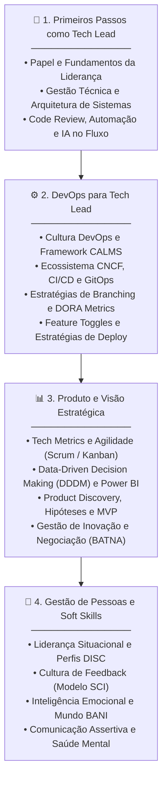

# 🚀 Formação Tech Lead — Rocketseat | Notas & Estudos

<p align="center">
  
  
  
  
</p>

---

## 📌 Sobre o Repositório

Repositório dedicado ao registro de anotações, resumos teóricos, mapas mentais, códigos de apoio, estudos de caso e projetos práticos desenvolvidos durante a **[Formação Tech Lead da Rocketseat](https://app.rocketseat.com.br/jornada/tech-lead/visao-geral)**.

O objetivo principal desta formação é capacitar o profissional técnico a realizar a transição do papel de executor (*desenvolvedor sênior/especialista*) para o papel de **Líder Técnico protagonista**, equilibrando com excelência:
- **Visão Arquitetural & Excelência Técnica**
- **Cultura DevOps & Métricas de Engenharia**
- **Produto, Negócio & Tomada de Decisão Baseada em Dados**
- **Gestão de Pessoas, Inteligência Emocional & Soft Skills**

---

## 🗺️ Visão Geral do Conteúdo Programático

A formação é dividida em 4 grandes pilares estratégicos:



---

## 📚 Estrutura Detalhada dos Módulos

### 🧭 Módulo 01: Primeiros Passos como Tech Lead
> *Fundamentos da liderança técnica, transição de carreira, tomada de decisão e qualidade de código.*

- [ ] **O Papel do Tech Lead**: Responsabilidades, limites de atuação e equilíbrio entre código, pessoas e negócio.
- [ ] **Gestão Técnica e Arquitetura**:
  - Soluções locais vs. soluções globais.
  - Definição clara de escopos técnicos e mitigação de débitos.
  - Fundamentos de arquitetura de sistemas escaláveis e observabilidade.
- [ ] **Code Review & Engenharia de Qualidade**:
  - Padrões de revisão sob o olhar de liderança técnica.
  - Automação com linters, *commitlint* e *GitHub Actions*.
  - Uso de convenções e Inteligência Artificial para otimizar o fluxo de PRs.
- [ ] **Quiz Avaliativo**: Primeiros Passos como Tech Lead.

---

### ⚙️ Módulo 02: DevOps para Tech Lead
> *Cultura ágil de operações, automação de esteiras, métricas de entrega e confiabilidade.*

- [ ] **A Origem do DevOps**:
  - Da Revolução Industrial ao Lean Manufacturing aplicado ao software.
  - Eliminação de silos entre desenvolvimento e operações.
- [ ] **Introdução ao DevOps para Líderes**:
  - As Três Maneiras: Fluxo, Feedback Rápido e Aprendizado Contínuo com Experimentação.
  - O framework **CALMS** (*Culture, Automation, Lean, Measurement, Sharing*).
- [ ] **Landscape e Ferramentas DevOps (CNCF)**:
  - Ecossistema Cloud Native Computing Foundation.
  - CI/CD contínuo e GitOps.
- [ ] **Controle de Versão e Estratégias de Branching**:
  - GitFlow, Release Branch e Trunk-Based Development.
  - Políticas de branches seguras e proteção de release.
- [ ] **Medindo Desempenho com DORA Metrics**:
  - *Deployment Frequency* (Frequência de Deploy).
  - *Lead Time for Changes* (Tempo de entrega de alterações).
  - *Change Failure Rate* (Taxa de falhas em mudanças).
  - *Time to Restore Service* / MTTR (Tempo médio de recuperação).
- [ ] **Feature Toggles**:
  - Tipos de toggles (Release, Experiment, Ops, Permission).
  - Testes em produção e redução de risco de deploy.
- [ ] **Estratégias de Deploy**:
  - Rolling Deployment, Blue-Green Deployment e Canary Releases.
- [ ] **Quiz Avaliativo & Microcertificação**: DevOps & Liderança Técnica.

---

### 📊 Módulo 03: Produto e Visão Estratégica
> *Alinhamento técnico ao negócio, metodologias ágeis, métricas e tomada de decisão orientada a dados.*

- [ ] **Tech Metrics**:
  - Métricas de engenharia, métricas ágeis, SRE e eficiência de times distribuídos.
- [ ] **Metodologias Ágeis**:
  - Princípios da agilidade além da cerimônia.
  - Aplicação prática de Scrum e Kanban para fluxo contínuo de valor.
- [ ] **Data-Driven Decision Making (DDDM)**:
  - Intuição vs. Evidência em decisões técnicas.
  - Qualidade de dados, amostragem e estatística aplicada à engenharia.
- [ ] **DDDM na Prática com Power BI**:
  - Dashboards interativos de produtividade, tempos de ciclo e gargalos de entrega.
- [ ] **Product Discovery & Design**:
  - Validação de hipóteses, ideação de MVPs e critérios de pivotagem.
  - Antecipação de riscos técnicos e arquiteturais no início do discovery.
- [ ] **Gestão e Estratégia de Inovação**:
  - Mapeamento e engajamento de *stakeholders*.
  - Negociação baseada em princípios e frameworks como **BATNA** (*Best Alternative to a Negotiated Agreement*).
  - Definição de MTP (*Massive Transformative Purpose*) e otimização do fluxo de valor.
- [ ] **Quiz Avaliativo & Microcertificação**: Produto e Visão Estratégica.

---

### 🤝 Módulo 04: Gestão de Pessoas e Soft Skills
> *Desenvolvimento de pessoas, inteligência emocional, resolução de conflitos e comunicação de alto impacto.*

- [ ] **Gestão de Pessoas & Cultura de Feedback**:
  - Estilos de liderança situacional.
  - Análise de perfis comportamentais (**DISC**).
  - Feedback estruturado com o **Modelo SCI** (*Situação, Comportamento, Impacto*).
  - Gestão de conflitos técnicos e interpessoais, delegação e avaliação de desempenho.
- [ ] **Inteligência Emocional**:
  - Os 5 pilares da Inteligência Emocional e neurociência aplicada.
  - Autoconhecimento, autogestão e resiliência em cenários **BANI** (*Brittle, Anxious, Non-linear, Incomprehensible*).
- [ ] **Comunicação Clara e Eficaz**:
  - Comunicação assertiva, escuta ativa e redução de ruídos.
  - Facilitação de alinhamentos técnicos e discussões de arquitetura.
- [ ] **Saúde Mental e Performance Sustentável**:
  - Prevenção a burnout, ansiedade e sobrecarga em times de tecnologia.
  - Criação de ambientes psicologicamente seguros para inovação.
- [ ] **Quiz Avaliativo & Certificado Final**: Formação Tech Lead Rocketseat.

---

## 📂 Organização das Pastas do Repositório

Sugestão de estrutura para organização das notas de estudo no repositório:

```text
.
├── README.md
├── 01-primeiros-passos-tech-lead/
│   ├── papel-do-tech-lead.md
│   ├── gestao-tecnica-e-arquitetura.md
│   └── code-review-e-qualidade.md
├── 02-devops-para-tech-lead/
│   ├── cultura-devops-e-calms.md
│   ├── branching-e-versao.md
│   ├── dora-metrics.md
│   ├── feature-toggles.md
│   └── estrategias-de-deploy.md
├── 03-produto-e-visao-estrategica/
│   ├── metodologias-ageis-e-metricas.md
│   ├── data-driven-decision-making.md
│   ├── product-discovery-e-mvp.md
│   └── negociacao-e-stakeholders.md
├── 04-gestao-de-pessoas-e-soft-skills/
│   ├── lideranca-e-disc.md
│   ├── feedback-modelo-sci.md
│   ├── inteligencia-emocional.md
│   ├── comunicacao-assertiva.md
│   └── saude-mental-e-performance.md
└── templates-e-frameworks/
    ├── template-1on1.md
    ├── template-adr-architecture-decision-record.md
    └── template-post-mortem.md
```

---

## 🛠️ Ferramentas, Conceitos & Frameworks Estudados

| Categoria | Tópicos & Tecnologias |
|---|---|
| **Liderança & Gestão** | DISC, Modelo SCI, Liderança Situacional, 1-on-1s, Avaliação de Desempenho |
| **Engenharia & Qualidade** | Code Review, GitFlow, Trunk-Based Development, GitHub Actions, Commitlint |
| **DevOps & Infra** | CALMS, DORA Metrics, CNCF Landscape, CI/CD, GitOps, Feature Flags |
| **Estratégias de Deploy** | Rolling, Blue-Green, Canary Releases |
| **Dados & Produto** | DDDM (Data-Driven Decision Making), Power BI, Product Discovery, MVP |
| **Negociação & Estratégia** | BATNA, Principled Negotiation, MTP, Mapeamento de Stakeholders |
| **Soft Skills** | Inteligência Emocional, Comunicação Assertiva, Mundo BANI, Segurança Psicológica |

---

## 🔗 Links Úteis & Referências

- [Página Oficial da Formação Tech Lead - Rocketseat](https://app.rocketseat.com.br/jornada/tech-lead/visao-geral)
- [DORA Metrics Guide (Google Cloud)](https://cloud.google.com/devops)
- [Cloud Native Computing Foundation (CNCF Landscape)](https://landscape.cncf.io/)
- [Architecture Decision Records (ADRs)](https://adr.github.io/)

---

## 📝 Licença

Este repositório está sob a licença [MIT](LICENSE). Sinta-se à vontade para utilizar as anotações e resumos como referência em seus próprios estudos.
