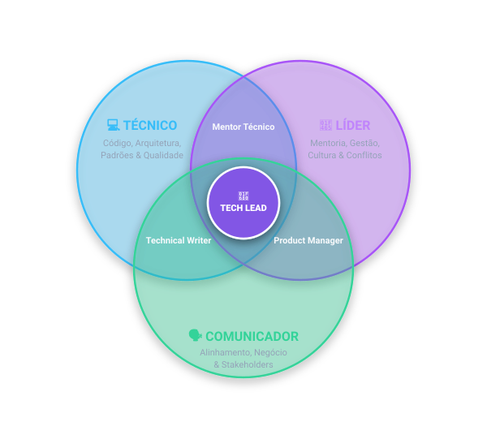
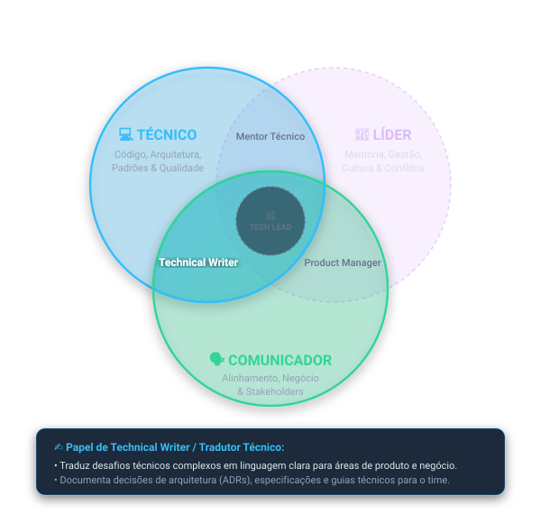
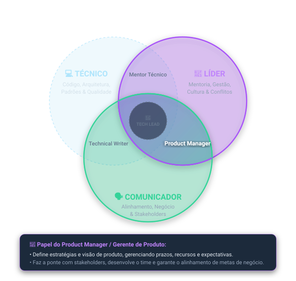
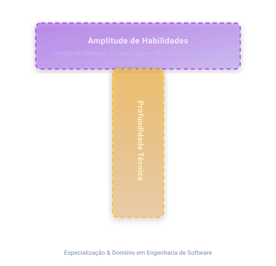

# O papel do Tech Lead

## Liderando com Excelência Técnica e Humana

1. O que é um Tech Lead?
   - Especialista Técnico?
   - Líder de Equipe?
   - Comunicador Eficaz?

    

   -> O Tech Lead é um especialista técnico que lidera uma equipe de desenvolvimento de software. Ele é responsável por garantir a qualidade do código, a arquitetura do sistema e a entrega do produto.
    
   -> Ele justamente faz a ponte entre a equipe de desenvolvimento e a gestão, garantindo que as necessidades do negócio sejam atendidas de forma técnica.
    
   -> Em outras palavras, é a intersecção entre Técnico, Líder e Comunicador.

   

   

   

2. Responsabilidades do Tech Lead

   ### Orientação Técnica
   - Decisões de Arquitetura: Definir a estrutura e os padrões do sistema.
   - Revisão de Código: Garantir a qualidade e a consistência do código produzido.
   - Resolução de Problemas Complexos: Abordar desafios técnicos que surgem durante o desenvolvimento.
   - Tech lead geralmente trabalha diretamente com algumas personas, como: Gerente de Projeto, PM, O Manager...
   - Basicamente é a pessoa que receberá problemas grandes, features/Requests bem grandes, ou seja, vai ser responsável em entender esses problemas e qual a melhor forma de abordar e resolver esses problemas, seja, querando em problemas menores , que possam ser 'atacados' de forma paralela pelo time
   - Entender quais são os riscos e as dificuldades que envolvem esses projetos também

   ### Gestão de Equipe
   - **Mentoria**: Auxiliar o desenvolvimento profissional dos membros da equipe.
   - **Distribuição de tarefas**: Alocar atividades com base nas habilidades e experiência dos desenvolvedores.
   - **Motivação da Equipe**: Criar um ambiente de trabalho positivos e colaborativo.

   ### Planejamento
   - **Estimativa de Esforço**: Avaliar o tempo e os recursos necessários para as tarefas.
   - **Alinhamento com Objetivos de Negócio**: Assegurar que o trabalho técnico suporta as metas estratégicas. É muito importante estar alinhado com o objetivo da empresa, saber para onde as 'coisas' estão se direcionando, para que de forma estratégica consiga ter uma visão melhor e consiga conciliar tanto a parte de código quanto a parte de negócio, pois, ambas são partes vitais e importantes para a empresa.
   - **Gerenciamento de Riscos**: Identificar e mitigar potenciais obstáculos no projeto.
     - Aceitar um certo risco é importante para que se possa crescer, ou seja, sair da zona de conforto, pois é somente assim que evoluímos. Desta forma, buscar identificar potenciais zonas de risco e avaliar se isso pode trazer uma instabilidade para o serviço ou até mesmo trazer/resultar em uma falha de segurança.
     - saber gerenciar esse risco e evoluir sem correr esse risco.

   ### Habilidades Necessárias
   1. Pontos necessários para ser um tech lead de alta performance
      - Técnico:
        - Conhecimento Aprofundado
        - Design de Sistemas
        - Adaptável

      - Líder:
        - Liderança
        - Comunicação Eficaz
        - Resolução de Conflitos

      - Comunicador:
        - Visão Estratégica: Ponto vital importante, aonde entender a visão estratégica da empresa em si, ou seja, para onde a empresa está querendo 'caminhar' ou evoluir, pode ser um diferencial nessa área.
        - Gestão de Projetos
        - Análise de Riscos

3. Desafios/Papel de Tech Lead
   - Equilíbrio Código/Gestão
     - Buscar entender o seu **split** (Percentual de tempo dedicado a cada atividade)
     - Um caso muito comum dentro das empresas hoje é o 70/30, ou seja, 70% de gestão e 30% de tempo por código.
     - Buscar se comunicar muito bem, entender esse balanço ou equilíbrio é algo fundamental, entendo assim o que a empresa espera de você.
   - Pressão por Resultados
     - Agora você será a pessoa que estará na frente do time
     - Será responsável por comunicar deadlines
     - Aceitar o desenvolvimento das features
     - Basicamente será a pessoas que eles vão chegar e perguntar:
       - A feature está pronta?
       - Vai ficar pronta até quando?
       - O que está faltando?
       - Qual o problema?
       - Como posso ajudar?
   - Diversidade de Equipe
     - É preciso saber como Líder entender o que cada um esta buscando e criar uma coesão no seu time, para que cada um se sinta desafiado na medida correta e também estar progredindo na velocidade correta.

## Tipos de Lideranças

### Liderança Técnica vs. Liderança Não Técnica

1. Liderança Técnica

- Técnico + Comunicador
  - Implementações:
    - O tech lead que vai sempre estar revisando os PRs, vai estar ativamente guiando seus liderados nas adoções técnicas.
    - É preciso imaginar que no dia a dia, estaremos lidando com pessoas de níveis diferentes, mas o importante é conseguir mostrar uma visão técnica muito bem solidificada, aonde você possa olhar para as pessoas e dizer 'você precisa corrigir especificamente isso, dentro do código, por causa de escalabilidade...' como por exemplo.
  - Eficiência dos processos: Trabalhar lado a lado com PM, para organizar tasks, analisar tasks grandes e quebrar em tarefas menores, que possam ser 'atacadas' de forma paralela pelo time.
  - Conhecimento especifico:
    - Muito importante o Tech lead ser aprofundado em alguma área específica...
    - Saber diferenciar/advogar quais são os prós e contras de algumas arquiteturas de sistema
      - Ex.: Quando eu devo utilizar um Monolito ou Microserviços
        - Monolito -> Nos leva para projetos menores, mais consolidade, sendo até mais fácil de gerenciar/trabalhar porque ele não é distribuido, mas chega determinados momentos que podem acontecer gargalos, resultando na situação de não ter tanta replicação...
        - Microserviços -> Nos leva para projetos maiores, mais complexos, aonde ele é distribuido, sendo até mais difícil de gerenciar/trabalhar, mas não acontecem gargalos, mas podem ficar mais caros...
        - Saber transformar um Monolito em Microserviços
        - Na parte técnica é necessário saber mostrar para as pessoas, para os stakeholders, quais são os prós e contras de cada tecnologia/arquitetura, para que o time possa se preocupar com a abordagem da implementação e o tech lead com a parte da arquitetura ou teórica de como o sistema vai evoluir depois de um tempo.
  - Busca definir a arquitetura de um novo sistema
  - Orienta a equipe na adoção de uma nova tecnologia
  - Realiza code reviews com foco em qualidade e boas práticas

  

  

1. Liderança Não Técnica

- Responsabilidades
  - Definir estratégias e metas organizacionais
  - Gerenciar recursos, prazos e orçamentos
  - Desenvolver a cultura e o ambiente de trabalho
    - Liderar para um lado mais 'humano' de soft skills
    - Olhar para os valores da empresa
    - Olhar para o lado de que time eu vou querer criar

  - Coordenar equipes multidisciplinares
    - Um exemplo é olhar para o Spotify hoje, aonde é adotado o conceito de 'Tribos', aonde a arquitetura organizacional é baseada em:
      - Tribos:
        - É o agrupamento de vários Squads que trabalham em uma área de negócio relacionada (ex.: Tribo de 'Música', Tribo de 'Pagamentos').
        - A Tribo funciona como uma 'incubadora' para os 'Squads', oferecendo um exossitema colaborativo.
        - Geralmente uma Tribo tem entre 40 e 150 pessoas para manter a coesão social e evitar burocracia excessiva.
      - Squads
        - É a menor unidade organizacional, análoga a um time Scrum(geralmente de 5 a 8 pessoas)
        - São autônomos e multidisciplinares, ou seja, possuem desenvolvedores, designers, especialistas em Produto (PO), etc.
        - Cada Squad tem uma missão de longo prazo (ex.: Melhorar o onboarding do usuário ou gerenciar a parte de pagamentos) e decide como vai atingir seus objetivos.
      - Capítulos
        - Como as pessoas estão espalhadas em Squads focados em produto, pode haver isolamento técnico.
        - O Capítulo resolve isso reunindo profissionais da mesma especialidade (ex.: todos os desenvolvedores Front-end de uma tribo ou todos os QAs).
        - O líder do capítulo ajuda no desenvolvimento de carreira e na padronização de boas práticas técnicas.
      - Guildas
        - É uma comunidade orgânica e voluntária de interesse comum que atravessa toda a empresa.
        - Qualquer pessoa pode criar ou participar de uma guilda (ex.: Guilda de Agile, Guilda de Testes Automatizados, Guilda de IA).
        - Serve para compartilhar conhecimento e alinhar padrões em nível global na companhia.

  - Desenvolver talentos e gerir performance
    - É importante olhar para o âmbito individual de cada um do seu time e saber quais os pontos fortes e fracos dessa pessoa, para que possa ser possível guiar essa pessoa, para que ela possa ter uma evolução na carreira. Como líder é necessário trazer desafios que aquela pessoa precisa participar para crescer.
    - Dar feedback na hora correta.
    - Reconhecer os pontos fortes dessa pessoa para que ela se senta acolhida dentro do time.
    -

- 

  

### Qual a motivação?

- Ambos os estilos são essenciais e complementares.
- Em que área você se encaixa mais agora?
- Desenvolver quais habilidades para equilibrar a liderança?

### Comparativo: Liderança Técnica vs. Liderança Não Técnica

| Aspecto                    | Liderança Técnica                            | Liderança Não Técnica                       |
| :------------------------- | :------------------------------------------- | :------------------------------------------ |
| **Foco Principal**         | Aspectos técnicos e soluções tecnológicas.   | Gestão de pessoas e estratégias de negócio. |
| **Conhecimento**           | Profundo conhecimento técnico.               | Habilidades gerenciais e estratégicas.      |
| **Responsabilidades**      | Decisões técnicas, qualidade do produto      | Metas organizacionais, cultura da equipe    |
| **Interação com a Equipe** | Orientação técnica, mentorias especializadas | Desenvolvimento profissional, feedback      |

## Habilidades em T

### Profundidade Técnica e Amplitude

1. Porque é importante desenvolver habilidades em T?
   - Melhoria na Liderança.
     - Sabendo quais são as áreas que eu devo focar mais o meu conhecimento e as áreas que eu tenho mais amplitude, eu vou conseguir despender mais tempo ali na parte liderança
     - É necessário ter uma amplitude que não é só Técnica e para isso, será necessário se colocar em posições de decisões, momentos de decisões. Você vai ter uma autoridade nessa questão de liderança muito maior.
        
        
   - Comunicação Eficaz.
     - Justamente por saber quais são as áreas que a gente tem que ter no nosso desenvolvimento e ter a nossa amplitude, já podemos ver que o desenvolvimento de software agora vai funcionar linkando outras áreas da empresa
        
        
   - Tomada de Decisão.
     - uma das áreas mais importantes, para que como líder, eu possa ser justamente a pessoa que vai chegar para resolver conflitos, vai ser a pessoa que vai guias a sua equipe tecnicamente, então basicamente sai ali do papel de contribuidor individual, onde você vai estar sempre ali na frente das mudanças, fazendo todos os pull requests, para conseguir dar espaço para que o seu time inteiro vire essa força multiplicadora. Que o time inteiro consiga emular mais ou menos aquilo que você estava fazendo, que tanto você consiga aprender com ele, como eles consigam aprender com você. Para que ai a tomada de decisão, seja algo mais simples. Seja mudando alguma arquitetura, tomando uma decisão quanto a negócio, de quais são as features que devem ser feitas mediante um certo prazo. Então, porque você vai estar muito mais exposto a esse tipo de questionamento, esse tipo de pergunta, você vai ter uma melhora na sua tomada de decisão.
        
        
2. Entendendo o Gráfico em T

   

   

   

   #### Barra (Eixo) Horizontal do 'T' -> Amplitude de Habilidades
   - **Gestão de Pessoas e Liderança:** Como liderança técnica, é necessário aprender bastante sobre os pontos abaixo, não quer dizer que você precise ser o maior especialista, a idéia é que você conquiste uma ampla camada de conhecimento que vão ajudar a progredir na sua carreira.
     - Gestão de pessoas
     - Motivação
     - Desenvolvimento de talentos

   - **Comunicação e Mediação:** Como Líder o seu papel também é dar 'palco' para a sua equipe, ou seja, é entender que é preciso mostrar o que meus desenvolvedores estão fazendo, é preciso guia-los corretamente, se caso ocorrer conflitos, é preciso que o líder seja o divisor de águas, ou seja, ser a pessoa que vai chegar e vai de forma edificante resolver o conflito para que as pessoas consigam tirar algo positivo dele.
     - Apresentações
     - Reuniões
     - Resolução de conflitos

   - **Planejamento e Negócio:** Na parte de planejamento, vai ser a parte aonde terá mais contato com stakeholders, vai estar em contato direto com as implementações de certas metodologias ágeis. E é justamente nessa parte de gestão que vai ajudar você a ter uma visão mais ampla do negócio e não apenas do desenvolvimento em si.
     - Planejamento
     - Acompanhamento
     - Metodologias Ágeis

   #### Barra (Eixo) Vertical do 'T' -> Profundidade Técnica
   - É preciso ter uma profundidade técnica excelente para quem já veio do desenvolvimento de software.
   - Neste ponto é aonde será investido a maior aprofundamento como profissional, porque, será necessário ser muito bom em resolver os problemas e ter um domínio avançado em áreas como arquitetura de software, padrões de design, escalabilidade, segurança, etc.

## Como desenvolver Habilidades em T?

- O que está faltando?
  - Como primeiro passo realmente entendero que está faltando para você nessas habilidades, pois, isso é algo pessoal.
  - Algumas pessoas tem habilidades técnicas, mas falta soft skills ou vice-versa.
  - É muito bom inicialmente ter essa introspecção para entender o que está faltando.
- Liderança e Gestão
  - Em seguida iniciar o processo de participar ativamente de reuniões de liderança e gestão, pois, ai você vai estar exposto a parte de tomada de decisão, basicamente tudo que é importante pro negócio da empresa, tanto as partes que são de tomada de decisão técnica como tomada de decisão não técnica, é extremamente importante que você esteja inserido ali, porque só assim você vai estar ali no ãmbito onde essas decisões vão estar sendo colocadas para você, que você vai estar sendo exposto para isso, consequentemente te tornando melhor nessa tomada de decisão e gestão.
- Mentorias e Networking
  - É necessário procurar alguém para ser o seu mentor e você dever ser o mentor de alguém, então aqui não é o bastante só que você tenha um mentor, mas sim que você se ponha na condição de mentor porque ai você vai estar exercitando skills necessárias para virar uma força potencializadora do seu time, que é exatamente importante.
  - Outro ponto importante
