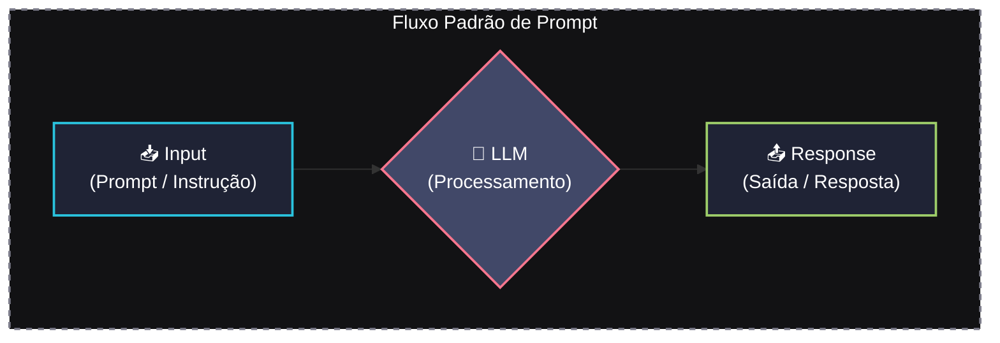

# 🤖 IA Generativa - Anotações e Estudos

> Repositório de anotações, diagramas e conceitos práticos desenvolvidos durante o curso de **Inteligência Artificial Generativa** da Rocketseat.

---

## 📌 Visão Geral

Este diretório é dedicado a registrar a evolução dos estudos sobre IA Generativa, compreendendo desde os fundamentos históricos e a matemática probabilística por trás dos modelos até as técnicas avançadas de Engenharia de Prompt e controle de parâmetros de LLMs (Large Language Models).

---

## 📁 Estrutura dos Arquivos

*   [diario_curso.md](file:///home/brunnomdp/Projetos/Development/rocketseat/inteligencia_artificial/diario_curso.md): Diário de bordo detalhado com todas as notas teóricas, definições de parâmetros, diagramas de fluxo e conceitos estudados.
*   [criacao_diagramas_markdown.md](file:///home/brunnomdp/Projetos/Development/rocketseat/inteligencia_artificial/criacao_diagramas_markdown.md): Guia prático documentando como estruturar e estilizar diagramas Mermaid diretamente em arquivos Markdown (`.md`).
*   [mermaid_formas_nos.md](file:///home/brunnomdp/Projetos/Development/rocketseat/inteligencia_artificial/mermaid_formas_nos.md): Guia rápido de referência com as formas de nós e sintaxes comuns utilizadas nos diagramas Mermaid.
*   [mcp.md](file:///home/brunnomdp/Projetos/Development/rocketseat/inteligencia_artificial/mcp.md): Documentação conceitual sobre o Model Context Protocol (MCP) e sua importância em fornecer contexto real do projeto aos agentes.
*   [Guia_Modos_Antigravity_IA.md](file:///home/brunnomdp/Projetos/Development/rocketseat/inteligencia_artificial/Guia_Modos_Antigravity_IA.md): Guia explicativo sobre os diferentes modos de operação do agente de IA do Antigravity IDE (Ask, Plan, Fast, Debug, Multitask).
*   [vibe-check/](file:///home/brunnomdp/Projetos/Development/rocketseat/inteligencia_artificial/vibe-check): Projeto prático da API VibeCheck desenvolvido em TypeScript com Fastify e SQLite (via better-sqlite3) para coleta e análise de sentimentos em feedbacks anônimos.
*   [assets/](file:///home/brunnomdp/Projetos/Development/rocketseat/inteligencia_artificial/assets): Pasta contendo as representações gráficas e capturas de tela dos conceitos de parametrização e técnicas de prompt.

---

## 🧪 Conteúdos Abordados

### 1. Fundamentos e Linha do Tempo da IA
*   Evolução histórica (do Teste de Turing de 1950 até as arquiteturas modernas pós-artigo *Attention is All You Need* em 2017).
*   Relacionamento dos conceitos entre Inteligência Artificial, Machine Learning, Deep Learning, Processamento de Linguagem Natural (NLP) e LLMs.

### 2. Engenharia de Prompt (Técnicas)
*   **Few-Shot**: Uso de múltiplos exemplos estruturados para guiar o formato da resposta.
*   **Role Method**: Definição de papéis, contexto e restrições para a persona da IA.
*   **Chain of Thought (CoT)**: Orientação de raciocínio passo a passo para resolução de problemas complexos.
*   **Tree of Thought (ToT)**: Exploração de caminhos e tomada de decisão através de ramificações lógicas de pensamentos.

### 3. Anatomia de um Prompt Estruturado
*   Formatos comuns (XML, Markdown, JSON, YAML).
*   Elementos cruciais de um bom prompt: *Price, Play, Reasoning, Instructions, Constraints e Examples*.
*   Uso de agentes e modelagem programática de prompts (e.g., framework DSPy).

### 4. Funcionamento Interno e Ajustes de Parâmetros
*   Conceito de **Tokens** e funcionamento da **Janela de Contexto**.
*   **Degradação de Contexto (Context Rot)** e estratégias para lidar com esquecimento de informações em conversas longas.
*   **Expansão de Contexto**: Uso de RAG (Retrieval Augmented Generation), conexão com APIs/Ferramentas externas e **MCP (Model Context Protocol)**.
*   Modelagem probabilística não determinística.
*   **Top K**, **Top P** e **Temperature** (controle de amostragem e criatividade na geração das respostas).

### 5. Limitações, Cuidados e Segurança (Limitations & Care)
*   **Hallucination (Alucinação)**: Compreensão de por que modelos inventam fatos falsos e técnicas de mitigação.
*   **Biases (Vieses)**: Como preconceitos humanos históricos nos dados de treino são replicados e formas de remediá-los.
*   **Guardrails**: Implementação de barreiras de proteção a nível de Comportamento, Entrada (Input filtering) e Saída (Output moderation) usando código e prompts específicos.
*   **Warnings (Avisos de Segurança e Ética)**: Discussão sobre a proliferação de Deepfakes, impactos éticos e de direitos autorais, e a dependência cognitiva da IA ("Brain rot").

### 6. Desenvolvimento Orientado a Contexto e Agentes (Agentic Coding)
*   Diferença conceitual entre Engenharia de Prompt e Engenharia de Contexto.
*   Modos de operação e workflow com agentes de IA (Ask, Plan, Fast, Debug, Multitask) utilizando o **Antigravity IDE**.
*   Uso prático do **Model Context Protocol (MCP)** para integrar agentes à infraestrutura do projeto (banco de dados, arquivos locais, documentação).

### 7. Projeto Prático: VibeCheck API
*   Desenvolvimento de uma API REST com **TypeScript** e **Fastify** seguindo especificações de PRD (Product Requirement Document) e SDD (System Design Document).
*   Persistência local robusta utilizando **SQLite** com a biblioteca `better-sqlite3`.
*   Estruturação de banco de dados relacional com integridade referencial, UUIDs e logs do SQLite.
*   Testes unitários e de integração utilizando **Vitest**, isolando o ambiente de banco de dados real através de conexões SQLite em memória (`:memory:`) durante a suíte de testes.

---

## 📊 Visualização com Mermaid

Muitos dos fluxos e esquemas deste curso estão ilustrados utilizando diagramas **Mermaid.js**, renderizados nativamente por plataformas como o GitHub e editores de markdown compatíveis. Veja um exemplo do fluxo básico de interação:

