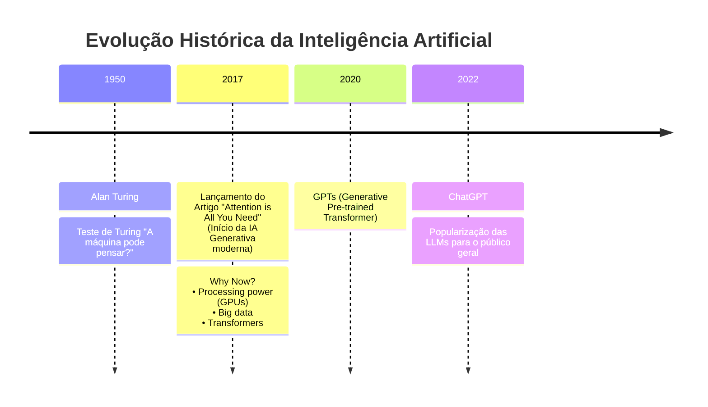
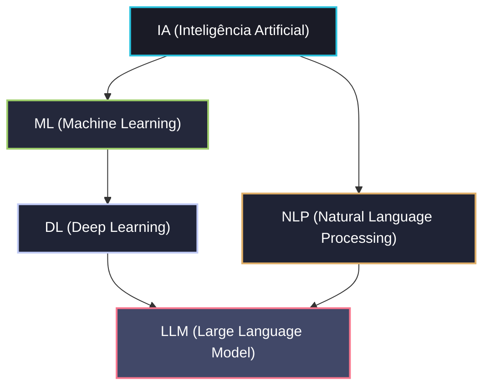
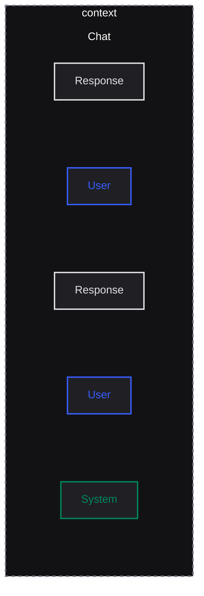
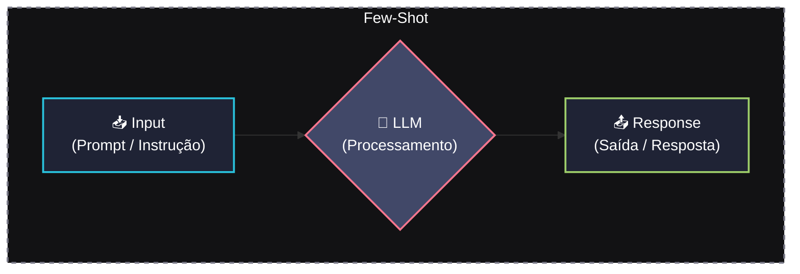

# Fundamentos de IA Generativa

## Introdução e Linha do Tempo da IA

Abaixo está a representação visual da evolução histórica da Inteligência Artificial em formato de linha do tempo:



---

## 📊 Relacionamento dos Conceitos de IA

Abaixo está a representação visual dos subcampos da Inteligência Artificial em formato de diagrama **Mermaid** (que é renderizado nativamente pelo GitHub, VS Code e a maioria dos visualizadores Markdown):




## Inteligência Artificial
- Palavras importantes nesse universo:
  - Probabilidade
  - Deterministico/Não deterministico
-  Inteligência artificial é probabilidade  

## Prompt
- Instruções para os GPTs
- "Inserção" de comandos/instruções via terminal
- 'System prompt'
  - praticamente é a personalidade daquela IA
  - O que ela tem de informação para aquele momento
  - As configurações de fábrica dela
  - Manual de instrução (Qual o comportamento, como ela vai responder, qual o tom de voz, quantas palavras ela vai usar, de que maneira vai ser respondido..)



## Prompt Techniques

### 1. Few Shot



- Se eu não consigo conversar ou passar informação correta para LLM, eu não vou conseguir extrair a melhor resposta possível
- As técnicas vão sempre guiar a gente, para tentar modificar um pouco essa resposta, mas sabendo que eu posso usar o mesmo prompt, eu posso ter uma resposta diferente, pois, tudo é probabilidade.
- Sobre engenharia de prompt ou construção de prompt, é que dependendo da LLM, você vai mudar a maneira das coisas e isso também vai mudar o resultado, para bom ou para ruim.
- Few shot ('Alguns exemplos'):
  - É a ideia de mandar alguns exemplos para a inteligência artificial, para que ela entenda o que você quer e te uma resposta melhor.


### 2. Role Method
- 'Deixa eu falar para a minha IA qual o papel dela...'
- Exemplos:
  - 'Você é especialista em...'
  - 'Haja como...'
  - 'Faça dessa forma..'

### 3. Chain of Thought


- Cadeia de pensamentos
- Exemplo de prompt
  - "Criar uma função que verifica se uma frase é um palíndromo (Lê igual de trás para frente e vice-versa), ignorando espaços e letras maiúsculas."

  - ```
    1. Criar uma função que verifica se uma frase é um palíndromo (lê igual de trás para frente e vice-versa), ignorando espaços e letras maiúsculas
    2. Verifique se a frase 'Ame a ema' é um palíndromo. Pense passo a passo:
        1. Como tratar a frase original?
        2. Como inverter a frase?
        3. Como comparar as duas?

    3. Depois do raciocínio, me entregue o código em JavaScript.
    ```

### 4. Tree of Thought


- Árvore de caminhos/pensamentos
- Exemplo:
    ```
    1. Aja como um arquiteto de Software. O problema é: Nossa aplicação React cresceu e o 'prop drilling' está insustentável. Explore 3 caminhos arquiteturais
    diferentes para resolver isso. Para cada caminho:
        1. Análise as vantagens.
        2. Análise os pontos de atenção (trade-offs).
        3. Avalie qual é o mais escalável a longo prazo.
    ```

## Estruturar o prompt


1. Opções
   - xml
   - md
   - JSON
   - yaml

2. mas qual seria a melhor opção?
   - Você não precisa de uma melhor estrutura dependendo da sua LLM
   - pontos a levar em consideração
     - PRICE
     - Play (you are...)
     - Reasoning (step by step, think about)
     - Instructions (objective, tasks..)
     - Constraints (never, don't)
     - Example (output included)

   - A maior dor... 
     - Não sei com qual LLM estou trabalhando no momento...
     - E se a LLM mudar?
     - Talvez precise mudar meu prompt

   - Uma saída...
     - Realmente precisamos de prompt?
     - A IA não é capaz de criar?
     - Porque ela mesmo não cria?
     - Exemplo
        ```
        > Crie um prompt usando tree of thought para resolver um problema de prop drilling no meu código React. 
        Esse prompt será utilizado no modelo Opus 4.5. Faça esse prompt com as melhores práticas para esse modelo.
        ```

    - prompt to prompt
      - O ouro em em mãos
      - Entendendo esse processo/contexto, você consegue construir um prompt para gerar um prompt, que vai gerar uma resposta.
        - E isso pode trazer resultados muito melhores do que o esperado...

    - DSPy
      - Python
      - Existe também para o universo de JS
      - É justamente o fato de você não precisar mais escrever prompt
        - Você simplesmente faz uma modelagem dos seus dados
        - Esse é o input, esse é o output e usa no meio do caminho 'chain of thought', usa no meio do caminho a estratégia 'React', NÃO O FRAMEWORK e sim a estratégia de agent chamada React, de 'Reagir..'
        - Ferramenta promissora
        - Menos prompt, mais codigo... mais modelagem de código... É possível extrair muito mais, sem precisar se preocupar com isso na sua ferramenta. quando estiver construindo 

## Token
- Unidade básica de texto para LLM
- IA "lê" e "escreve"
- Fundamento para **LLMs**
- Pode ser uma palavra ou um pedaço de uma palavra
- Define janela de contexto
- Impacta custo da **API**

- Janela de contexto: É a quantidade de texto que a IA pode processar de uma vez.
    - Quanto maior a janela de contexto, mais texto a IA pode processar de uma vez.
    - Quanto menor a janela de contexto, menos texto a IA pode processar de uma vez.
    - Quanto maior a janela de contexto, mais cara é a API.
    - Quanto menor a janela de contexto, mais barata é a API.


- Modelos e Preços de modelos

    


## Probabilistic (non-determinstic)
- Ocorre que quando você passa um prompt para uma LLM, ele não retorna uma resposta "exata", mas sim uma resposta "provável"

    

- Probabilistico e não determinístico:
  - Porque isso é relevante?
    - Porque é possível controlar essa probabilidade, se eu quiser...

## Generation control (fine tuning)
- Top k => quantidade de opções
    
    
  - me de da amostragem inteira, 3 opções por algum critério de avaliação, seja nota ou algo de destaque/valor estarão mais acima...
  - Apartir dessa quantidade de opções, já posso começar a controlar de como esta sendo gerado toda essa resposta da IA para mim...
<br>
<br>
- Top p => Probabilidade de opções
    
    
  - Se for de 75% para baixo, nem visualiza...
<br>
<br>
- Temperature => criatividade
- É a criatividade

    

  - quanto maior a temperatura, maior será a criatividade, ou seja, quanto mais proximo do 1, mais criativo, mais aleatorio, mais imprevisivel, menos repetitivo.
  - quanto menor a temperatura, menor será a criatividade, ou seja, quanto mais proximo do 0, mais deterministico, mais repetitivo, menos criativo.


