# Fundamentos de IA Generativa

## Introdução e Linha do Tempo da IA

Abaixo está a representação visual da evolução histórica da Inteligência Artificial em formato de linha do tempo:

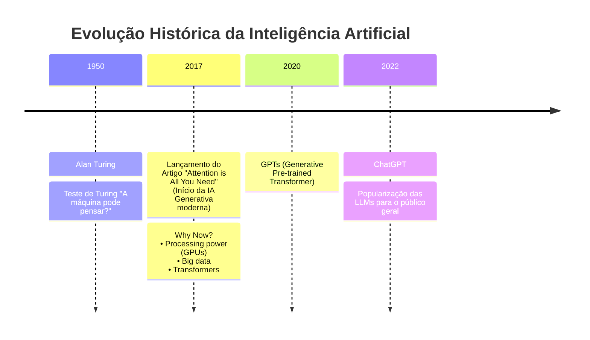

---

## 📊 Relacionamento dos Conceitos de IA

Abaixo está a representação visual dos subcampos da Inteligência Artificial em formato de diagrama **Mermaid** (que é renderizado nativamente pelo GitHub, VS Code e a maioria dos visualizadores Markdown):

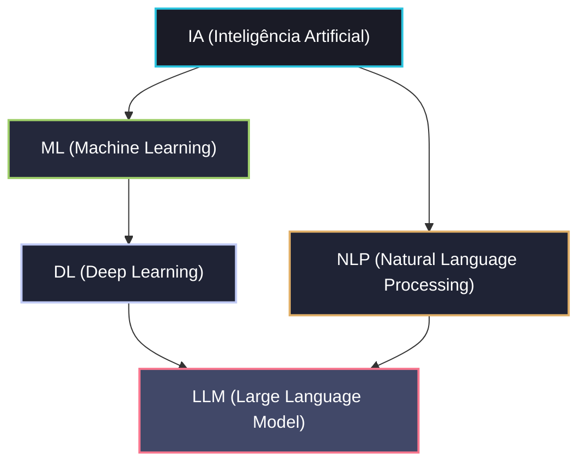


## Inteligência Artificial
- Palavras importantes nesse universo:
  - Probabilidade
  - Deterministico/Não deterministico
-  Inteligência artificial é probabilidade  

## Prompt
- Instruções para os GPTs
- "Inserção" de comandos/instruções via terminal
- 'System prompt'
  - praticamente é a personalidade daquela IA
  - O que ela tem de informação para aquele momento
  - As configurações de fábrica dela
  - Manual de instrução (Qual o comportamento, como ela vai responder, qual o tom de voz, quantas palavras ela vai usar, de que maneira vai ser respondido..)

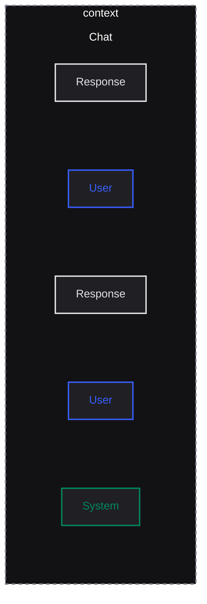

## Prompt Techniques

### 1. Few Shot

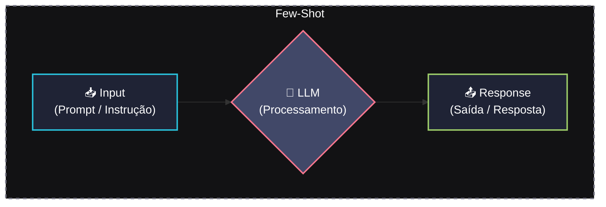

- Se eu não consigo conversar ou passar informação correta para LLM, eu não vou conseguir extrair a melhor resposta possível
- As técnicas vão sempre guiar a gente, para tentar modificar um pouco essa resposta, mas sabendo que eu posso usar o mesmo prompt, eu posso ter uma resposta diferente, pois, tudo é probabilidade.
- Sobre engenharia de prompt ou construção de prompt, é que dependendo da LLM, você vai mudar a maneira das coisas e isso também vai mudar o resultado, para bom ou para ruim.
- Few shot ('Alguns exemplos'):
  - É a ideia de mandar alguns exemplos para a inteligência artificial, para que ela entenda o que você quer e te uma resposta melhor.


### 2. Role Method
- 'Deixa eu falar para a minha IA qual o papel dela...'
- Exemplos:
  - 'Você é especialista em...'
  - 'Haja como...'
  - 'Faça dessa forma..'

### 3. Chain of Thought
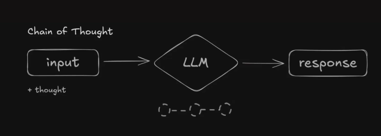

- Cadeia de pensamentos
- Exemplo de prompt
  - "Criar uma função que verifica se uma frase é um palíndromo (Lê igual de trás para frente e vice-versa), ignorando espaços e letras maiúsculas."

  - ```
    1. Criar uma função que verifica se uma frase é um palíndromo (lê igual de trás para frente e vice-versa), ignorando espaços e letras maiúsculas
    2. Verifique se a frase 'Ame a ema' é um palíndromo. Pense passo a passo:
        1. Como tratar a frase original?
        2. Como inverter a frase?
        3. Como comparar as duas?

    3. Depois do raciocínio, me entregue o código em JavaScript.
    ```

### 4. Tree of Thought
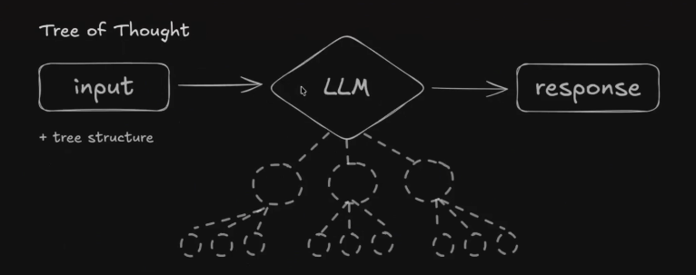

- Árvore de caminhos/pensamentos
- Exemplo:
    ```
    1. Aja como um arquiteto de Software. O problema é: Nossa aplicação React cresceu e o 'prop drilling' está insustentável. Explore 3 caminhos arquiteturais
    diferentes para resolver isso. Para cada caminho:
        1. Análise as vantagens.
        2. Análise os pontos de atenção (trade-offs).
        3. Avalie qual é o mais escalável a longo prazo.
    ```

## Estruturar o prompt
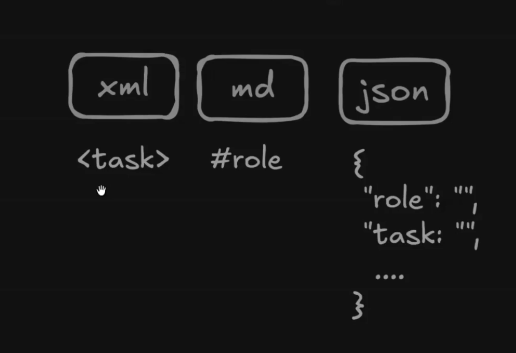

1. Opções
   - xml
   - md
   - JSON
   - yaml

2. mas qual seria a melhor opção?
   - Você não precisa de uma melhor estrutura dependendo da sua LLM
   - pontos a levar em consideração
     - PRICE
     - Play (you are...)
     - Reasoning (step by step, think about)
     - Instructions (objective, tasks..)
     - Constraints (never, don't)
     - Example (output included)

   - A maior dor... 
     - Não sei com qual LLM estou trabalhando no momento...
     - E se a LLM mudar?
     - Talvez precise mudar meu prompt

   - Uma saída...
     - Realmente precisamos de prompt?
     - A IA não é capaz de criar?
     - Porque ela mesmo não cria?
     - Exemplo
        ```
        > Crie um prompt usando tree of thought para resolver um problema de prop drilling no meu código React. 
        Esse prompt será utilizado no modelo Opus 4.5. Faça esse prompt com as melhores práticas para esse modelo.
        ```

    - prompt to prompt
      - O ouro em em mãos
      - Entendendo esse processo/contexto, você consegue construir um prompt para gerar um prompt, que vai gerar uma resposta.
        - E isso pode trazer resultados muito melhores do que o esperado...

    - DSPy
      - Python
      - Existe também para o universo de JS
      - É justamente o fato de você não precisar mais escrever prompt
        - Você simplesmente faz uma modelagem dos seus dados
        - Esse é o input, esse é o output e usa no meio do caminho 'chain of thought', usa no meio do caminho a estratégia 'React', NÃO O FRAMEWORK e sim a estratégia de agent chamada React, de 'Reagir..'
        - Ferramenta promissora
        - Menos prompt, mais codigo... mais modelagem de código... É possível extrair muito mais, sem precisar se preocupar com isso na sua ferramenta. quando estiver construindo 

## Token
- Unidade básica de texto para LLM
- IA "lê" e "escreve"
- Fundamento para **LLMs**
- Pode ser uma palavra ou um pedaço de uma palavra
- Define janela de contexto
- Impacta custo da **API**

- Janela de contexto: É a quantidade de texto que a IA pode processar de uma vez.
    - Quanto maior a janela de contexto, mais texto a IA pode processar de uma vez.
    - Quanto menor a janela de contexto, menos texto a IA pode processar de uma vez.
    - Quanto maior a janela de contexto, mais cara é a API.
    - Quanto menor a janela de contexto, mais barata é a API.


- Modelos e Preços de modelos

    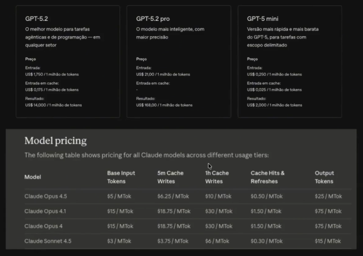


## Probabilistic (non-determinstic)
- Ocorre que quando você passa um prompt para uma LLM, ele não retorna uma resposta "exata", mas sim uma resposta "provável"

    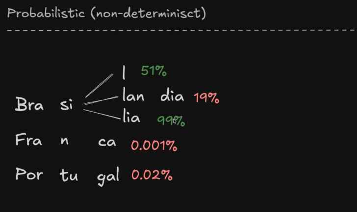

- Probabilistico e não determinístico:
  - Porque isso é relevante?
    - Porque é possível controlar essa probabilidade, se eu quiser...

## Generation control (fine tuning)
- Top k => quantidade de opções
    
    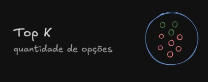
  - me de da amostragem inteira, 3 opções por algum critério de avaliação, seja nota ou algo de destaque/valor estarão mais acima...
  - Apartir dessa quantidade de opções, já posso começar a controlar de como esta sendo gerado toda essa resposta da IA para mim...
<br>
<br>
- Top p => Probabilidade de opções
    
    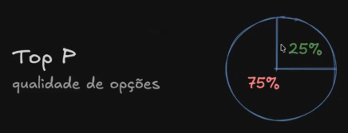
  - Se for de 75% para baixo, nem visualiza...
<br>
<br>
- Temperature => criatividade
- É a criatividade

    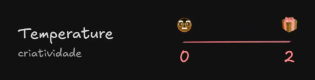

  - quanto maior a temperatura, maior será a criatividade, ou seja, quanto mais proximo do 1, mais criativo, mais aleatorio, mais imprevisivel, menos repetitivo.
  - quanto menor a temperatura, menor será a criatividade, ou seja, quanto mais proximo do 0, mais deterministico, mais repetitivo, menos criativo.


## Context
- Pensa como uma memória a curto prazo, de uma conversa com alguém

    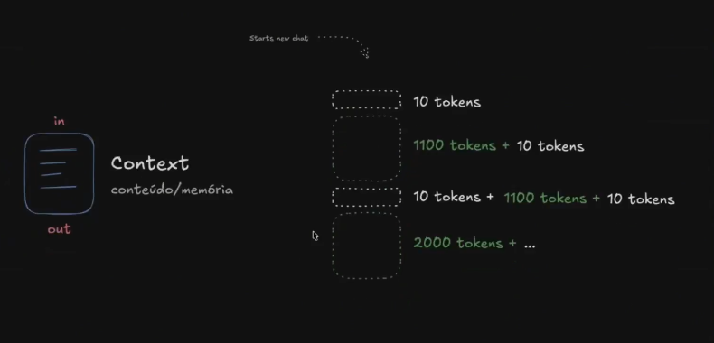

1. O que é context?
    - Basicamente é tudo que você envia para a LLM, seja instrução ou a conversa inteira que você já teve com ela.
    - Como podemos ver na imagem, existe uma conversa anterior, então esse contexto ajuda a LLM a entender o que está acontecendo na conversa.
    - E no principio, quando iniciamos o contexto, é basicamente como um quadro em branco, aonde geralmente iniciamos com 'System prompt', aonde falamos pra IA como ela deve agir, qual o tom de voz, qual o publico alvo, etc... 
    - Logo em seguida mandamos mais informações, bem como um chat literalmente, aonde vamos acumulando mensagens...
      - No contexto é bem relevante entender isso...porque ao mandar mais informações no contexto, ele vai se acumular com as informações antigas...

2. Porque o fato de acumulo de mensagens é relevante?
 - Context window (limites de contexto)
   - Define os limites do contexto
   - Chega um momento que esse limite ou essa janela é extrapolado e a informação mais antiga é esquecida.
   - Existem 'Truques' na janela de contexto, que é super relevante para trabalhar de uma maneira inteligente, de modo que a IA não esqueça do que foi falado anteriormente.
   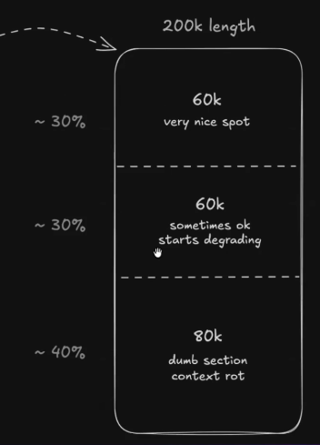
   - O melhor momento para trabalhar com uma tarefa da  inteligencia artificial é quando iniciamos um novo chat ou também, como por exemplo no gemini, quando damos o comando /clear e zeramos o contexto. Cerca de 30% => 60k tokens (very nice spot)
   - Na parte do meio, que são ainda em torno de 30% => 60k tokens (sometimes ok, starts degrading)
   - Já dos 60% para frente, é aonde começa ficar literalmente 'retardada'ou degradada... e é aonde muitos comentam: "Nossa, minha IA não esta boa como antes!"
     - 40% => 80k (dumb section context rot)
     - Apodrecimento do contexto
     - pede um resumo da janela atual, desliga, da um /clear ou fecha e abre novamente...

 - Context rot
   - Conversa longa demais
   - perda de contexto
   - Apodrecimento do contexto
   - Respostas não fazem sentido, inventa, delira
   - Solução: apaga o contexto e inicia novamente

   - Compact context
   - Sintese do contexto anterior (da janela)
     - Resumo do contexto
     - Perda de direcionamentos relevantes
     - Inteligência artifical não é perfeita
     - ela não veio para te substituir, mas sim para te auxiliar nas demais tarefas do dia a dia...
     - Para que ela possa te auxiliar de forma correta, você precisa direciona-la corretamente.
     - É uma ferramente sensacional e quanto mais nós tivermos domínio sobre ela, mais usaremos ela de uma maneira saúdavel, menos hype e mais uso inteligente...
       

3. Context Expansion
   - Algumas estratégias de expansão de contexto vem de encontro a uma dificuldade obvia
   - A LLM é treinada até determinado ponto
   - Forma de trazer atualidades para o contexto
     - RAG (Retrieval Augmented Generation)
       - Serve para injetar documentos e informações que não estejam em lugar nenhum, confidenciais talvez
       - Existe uma estratégia de ser guardado em um banco de dados, que é chamado de vetorial, para que seja resgatado realmente a nível de contexto/semântica
     - Tools (ferramentas)
       - APIs => vou conectar por exemplo com as issues do github e trazendo para o contexto...
     - MCP (Model Context Protocol)
       - Criar um protocolo, um conjuntinho de regras, aonde é definido os padrões para que todas as empresas sigam esse conjunto de regras, posteriormente seja adicionado na ferramenta e todo mundo tenha acesso as APIs
       - Apartir desse ponto ja exige atenção, pois é nesse ponto que o contexto já começa a ficar apodrecido...
         - Porque a galera começa a colocar os 200 MCPs criados, que nunca se quer vão ser utilizados...para uma tarefa especifica que será iniciada e o que acontece?
           - o novo chat já é injetado com essa quantidade enorme de coisas..que talvez nem sejam utilizadas
           - para arrumar é so desativar...
           - Assim as respostas já serão melhores
     - Skills
       - Seriam habilidades extras que a IA pode desenvolver
       - habilidades específicas
         - Nome e descrição...
     - Markdown(.md)

## Limitations and Care

Abaixo está o diagrama representativo das limitações das IAs Generativas, abordando alucinações, vieses e os mecanismos de defesa (guardrails) utilizados para controlá-los:

```mermaid
graph TD
    %% Bloco Central (Limitações e Cuidados)
    subgraph LC ["⚠️ Limitations and Care"]
        direction TB
        H["Hallucination (Alucinação)"]
        B["Biases (Viesses)"]
        G["Guardrails (Diretrizes/Mecanismos)"]
    end

    %% Ramificações de Hallucination
    H --> H1["🔍 O que é? <br> Respostas incorretas geradas com alta confiança."]
    H --> H2["⚙️ Causas: <br> • Limitação dos dados de treino <br> • Padrões probabilísticos falhos"]
    H --> H3["🛡️ Mitigação: <br> • RAG/MCP <br> • Temperatura baixa <br> • Chain of Thought <br> • Few-shot"]

    %% Ramificações de Biases
    B --> B1["🔍 O que é? <br> Preconceitos ou distorções herdados dos dados históricos."]
    B --> B2["⚠️ Impactos: <br> • Respostas discriminatórias <br> • Falta de neutralidade factual"]
    B --> B3["🛡️ Mitigação: <br> • Curadoria ativa de dados <br> • Fine-tuning de alinhamento (RLHF)"]

    %% Ramificações de Guardrails
    G --> G1["🔍 O que é? <br> Filtros de segurança entre o usuário e a LLM."]
    G --> G2["⚙️ Ações comuns: <br> • Bloqueio de termos sensíveis <br> • Formatação rígida de saída (JSON)"]
    G --> G3["🛠️ Ferramentas: <br> • NeMo Guardrails <br> • Llama Guard"]

    %% Estilização Visual (Estética Dark/Ajustada)
    style LC fill:#121214,stroke:#7c7c8a,stroke-width:2px,stroke-dasharray: 5 5,color:#fff
    style H fill:#1f2335,stroke:#f7768e,stroke-width:2px,color:#fff
    style B fill:#1f2335,stroke:#e0af68,stroke-width:2px,color:#fff
    style G fill:#1f2335,stroke:#9ece6a,stroke-width:2px,color:#fff

    style H1 fill:#24283b,stroke:#565f89,stroke-width:1px,color:#cfcfff
    style H2 fill:#24283b,stroke:#565f89,stroke-width:1px,color:#cfcfff
    style H3 fill:#24283b,stroke:#565f89,stroke-width:1px,color:#cfcfff

    style B1 fill:#24283b,stroke:#565f89,stroke-width:1px,color:#cfcfff
    style B2 fill:#24283b,stroke:#565f89,stroke-width:1px,color:#cfcfff
    style B3 fill:#24283b,stroke:#565f89,stroke-width:1px,color:#cfcfff

    style G1 fill:#24283b,stroke:#565f89,stroke-width:1px,color:#cfcfff
    style G2 fill:#24283b,stroke:#565f89,stroke-width:1px,color:#cfcfff
    style G3 fill:#24283b,stroke:#565f89,stroke-width:1px,color:#cfcfff
```

### Hallucination
- IA inventa fatos falsos
- Baseado em probabilidade estatística
- Respostas parecem muito convicentes
- Falta consulta a fatos
- Prioriza fluidez sobre verdade

### Biases
- Dados refletem preconceitos humanos.
- IA replica padrões tendenciosos.
- Falta diversidade no treinamento.
- Respostas podem ser injustas.
- Exige monitoramento humano contante.

### Guardrails
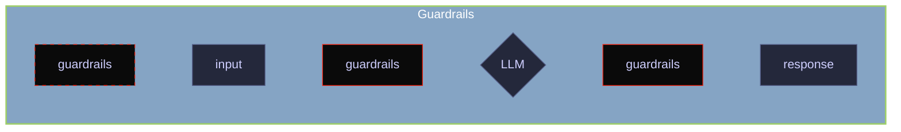

- Guardrails => são proteções que podemos encontrar em curvas mais acentuadas em rodovias ou estadas, ou seja, uma camada de segurança
- Conforme o grafico a cima, teriamos essas proteções em questões de níveis:
  - teria um guardrails anterior a uma conversa (input)
  - teria um guardrails para chegar na LLM
  - teria um guardrail anterior a resposta (response)
- O guardrails: "can be prompt or code"
  1. Behavioral (System level policies)
    - reject some topics
    - rate limit / auth
    - brand reputation
  2. Input (prompt filtering)
    - detect jailbreak
    - filter hate speech
    - block X, Y information
  3. Output (filter/moderation)
    - fact check
    - keyword/phrases
    - format

- Exemplo
```
// Pseudocode example for a JavaScript developer
async function getSafeAIResponse(prompt) {
    // 1. Input Guardrail: Check prompt for safety
    const promptModerationResult = await moderationService.check(prompt)
    if (promptModerationResult.isUnsafe) {
        return "I cannot process that request!"
    }

    // 2. Generate AI response
    const aiResponse = await llm.generate(prompt)

    // 3. Output Guardrail: Check AI response for safety
    const responseModerationResult = await moderationService.check(aiResponse)
    if (responseModerationResult.isUnsafe) {
        return "I'm sorry. I cannot provide that information!"
    }

    return aiResponse
}
```

- "You are helpfull and harmless AI assistant"
- "You must notgenerate hate speech, sexually explicit content or promote violence."

## Warnings
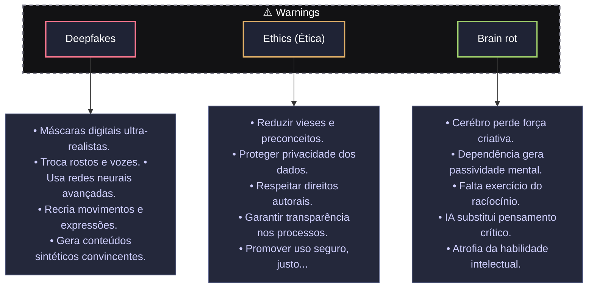