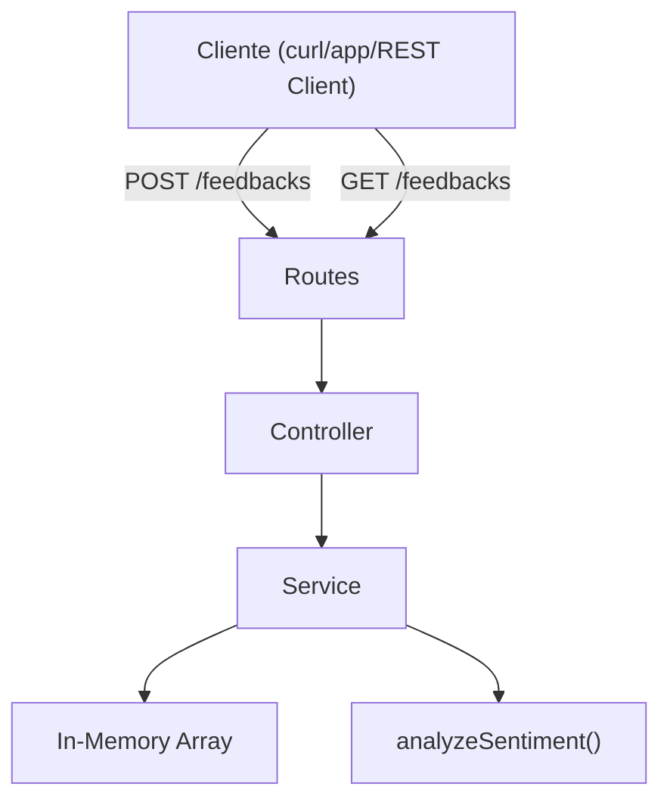

# Walkthrough — Projeto VibeCheck

## Resumo

Implementação completa da API VibeCheck — uma API minimalista para coleta de feedbacks anônimos com análise de sentimento simulada, conforme o [PRD](file:///home/brunnomdp/Projetos/Development/rocketseat/inteligencia_artificial/vibe-check/docs/core/prd.md) e [SDD](file:///home/brunnomdp/Projetos/Development/rocketseat/inteligencia_artificial/vibe-check/docs/core/sdd.md).

---

## Arquivos Criados

| Arquivo | Propósito |
|---|---|
| [package.json](file:///home/brunnomdp/Projetos/Development/rocketseat/inteligencia_artificial/vibe-check/package.json) | Configuração do projeto com scripts `dev`, `build`, `start`, `test`, `test:watch` e dependências (Fastify, Vitest, UUID) |
| [tsconfig.json](file:///home/brunnomdp/Projetos/Development/rocketseat/inteligencia_artificial/vibe-check/tsconfig.json) | TypeScript strict, ES2022, Node16 modules (excluindo `.spec.ts` do build) |
| [.gitignore](file:///home/brunnomdp/Projetos/Development/rocketseat/inteligencia_artificial/vibe-check/.gitignore) | Ignora `node_modules/` e `dist/` |
| [feedback.ts](file:///home/brunnomdp/Projetos/Development/rocketseat/inteligencia_artificial/vibe-check/src/types/feedback.ts) | Enum `Sentiment` e interfaces `CreateFeedbackInput`, `Feedback` |
| [feedback-service.ts](file:///home/brunnomdp/Projetos/Development/rocketseat/inteligencia_artificial/vibe-check/src/services/feedback-service.ts) | Validação, análise de sentimento e persistência in-memory |
| [feedback-service.spec.ts](file:///home/brunnomdp/Projetos/Development/rocketseat/inteligencia_artificial/vibe-check/src/services/feedback-service.spec.ts) | Testes unitários para o Service (18 testes) |
| [feedback-controller.ts](file:///home/brunnomdp/Projetos/Development/rocketseat/inteligencia_artificial/vibe-check/src/controllers/feedback-controller.ts) | Handler HTTP (orquestra service → resposta para criação e listagem) |
| [feedback-routes.ts](file:///home/brunnomdp/Projetos/Development/rocketseat/inteligencia_artificial/vibe-check/src/routes/feedback-routes.ts) | Plugin Fastify com `POST /feedbacks` e `GET /feedbacks` |
| [server.ts](file:///home/brunnomdp/Projetos/Development/rocketseat/inteligencia_artificial/vibe-check/src/server.ts) | Entry point — Fastify com logger na porta 3333 |
| [requests.http](file:///home/brunnomdp/Projetos/Development/rocketseat/inteligencia_artificial/vibe-check/requests.http) | Exemplos de requisições prontos para uso em IDEs com REST Client |

---

## Arquitetura



---

## Testes Realizados

### ✅ Testes Unitários (Vitest)
Executando `pnpm test` temos 18 casos de testes validados:
- Validação de caracteres limitadores (mínimo de 10, máximo de 500)
- Mapeamento correto de sentimentos (`POSITIVE`, `NEGATIVE`, `NEUTRAL`) com suporte a Case-Insensitive
- Geração correta da estrutura do feedback (UUID v4 e Data ISO)

### ✅ Testes Manuais (REST Client / curl)

| Cenário | Endpoint | Input | Status | Sentiment |
|---|---|---|---|---|
| Feedback positivo | `POST /feedbacks` | `"O serviço é ótimo, adorei a experiência!"` | `201` | `POSITIVE` |
| Feedback negativo | `POST /feedbacks` | `"O sistema está muito lento e com erro constante"` | `201` | `NEGATIVE` |
| Feedback neutro | `POST /feedbacks` | `"Utilizei o serviço normalmente hoje"` | `201` | `NEUTRAL` |
| Conteúdo muito curto | `POST /feedbacks` | `"ok"` | `400` | — |
| Listar feedbacks | `GET /feedbacks` | — | `200` | Retorna lista em memória |

---

## Como Rodar

```bash
# Desenvolvimento (hot reload)
pnpm dev

# Executar testes unitários
pnpm test

# Build para produção
pnpm build

# Rodar build
pnpm start
```
