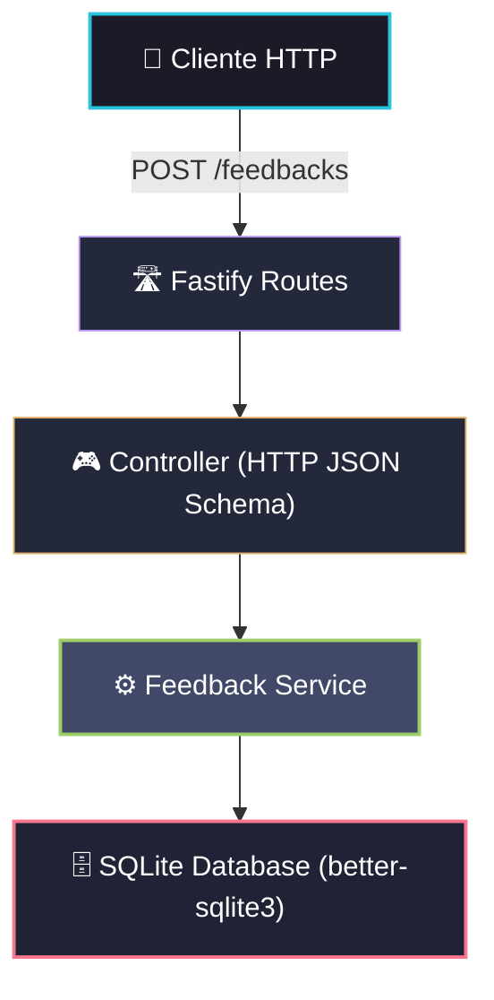

# Especificação Técnica — Persistência com SQLite (VibeCheck)

Esta especificação técnica define a transição do armazenamento temporário em memória (MVP) para um banco de dados relacional leve local (**SQLite**), garantindo resiliência dos dados de feedback coletados sem comprometer a simplicidade e a performance da API.

---

## 1. Objetivos

- **Resiliência de Dados**: Evitar a perda de feedbacks quando a aplicação for reiniciada ou atualizada.
- **Simplicidade de Setup**: Manter a facilidade de execução do projeto sem a necessidade de gerenciar serviços/containers externos de banco de dados (como PostgreSQL ou MySQL).
- **Isolamento em Testes**: Garantir que a suíte de testes unitários/integração continue rodando de forma isolada, rápida e sem poluir o banco de dados de desenvolvimento.
- **Conformidade de Negócio**: Manter o princípio de **Total Anonimato** (não armazenar IPs, User-Agents, e-mails ou quaisquer outros dados identificáveis).

---

## 2. Pilha Tecnológica e Arquitetura

### Driver de Conexão: `better-sqlite3`
Optou-se pelo uso da biblioteca [`better-sqlite3`](https://github.com/WiseLibs/better-sqlite3) por ser o driver SQLite mais rápido, seguro e síncrono para Node.js. 

> [!TIP]
> **Por que `better-sqlite3` em vez de `sqlite3` assíncrono?**
> - **Performance**: É significativamente mais rápido em operações de leitura/escrita.
> - **Simplicidade**: A API síncrona elimina a necessidade de `async/await` adicionais nas queries de banco de dados locais, simplificando o fluxo no service e mantendo a assinatura das funções do domínio limpas.
> - **TypeScript**: Possui excelentes definições de tipo via `@types/better-sqlite3`.



---

## 3. Modelagem do Banco de Dados (Schema)

O banco conterá uma única tabela chamada `feedbacks`. O schema SQL de criação é o seguinte:

```sql
CREATE TABLE IF NOT EXISTS feedbacks (
  id TEXT PRIMARY KEY,
  content TEXT NOT NULL,
  sentiment TEXT NOT NULL,
  created_at TEXT NOT NULL
);
```

### Detalhes dos Campos

| Campo | Tipo SQL | Representação TS | Descrição |
|---|---|---|---|
| `id` | `TEXT` | `string` | Identificador único gerado como UUID v4. |
| `content` | `TEXT` | `string` | Conteúdo do feedback (10 a 500 caracteres). |
| `sentiment` | `TEXT` | `Sentiment` | Sentimento analisado (`POSITIVE`, `NEGATIVE`, `NEUTRAL`). |
| `created_at` | `TEXT` | `string` | Data e hora de criação em formato de string ISO-8601. |

---

## 4. Impacto e Alterações Propostas

### 4.1 Instalação de Dependências

Será necessário instalar o driver e seus respectivos tipos usando o `pnpm`:

```bash
pnpm add better-sqlite3
pnpm add -D @types/better-sqlite3
```

### 4.2 Configuração do Git (`.gitignore`)

Como o banco de dados criará arquivos locais, devemos ignorá-los para evitar o versionamento acidental de dados locais:

```diff
# ... outras regras ...
+ *.db
+ *.db-journal
```

### 4.3 Camada de Serviço e Persistência ([feedback-service.ts](file:///home/brunnomdp/Projetos/Development/rocketseat/inteligencia_artificial/vibe-check/src/services/feedback-service.ts))

O arquivo de serviço será reestruturado para gerenciar a conexão com o banco de dados.

- **Conexão local**: A conexão inicializará um arquivo `database.db` na raiz do projeto (ou no caminho especificado por variável de ambiente).
- **Inicialização DDL**: Na inicialização do módulo, criamos a tabela caso ela não exista.
- **Operação de Escrita (`createFeedback`)**:
  Substituir o `feedbacks.push(feedback)` por uma query parametrizada (para evitar SQL Injection):
  ```typescript
  const stmt = db.prepare('INSERT INTO feedbacks (id, content, sentiment, created_at) VALUES (?, ?, ?, ?)');
  stmt.run(feedback.id, feedback.content, feedback.sentiment, feedback.createdAt);
  ```
- **Operação de Leitura (`getAllFeedbacks`)**:
  Substituir o retorno do array em memória por uma busca no banco:
  ```typescript
  const stmt = db.prepare('SELECT * FROM feedbacks ORDER BY created_at DESC');
  return stmt.all() as Feedback[];
  ```

---

## 5. Estratégia de Testes Automatizados

Para garantir que os testes rodem de maneira rápida, isolada e sem gerar arquivos de banco indesejados no disco de desenvolvimento, utilizaremos um banco SQLite em memória (`:memory:`) exclusivo para a suíte de testes.

No arquivo [`feedback-service.spec.ts`](file:///home/brunnomdp/Projetos/Development/rocketseat/inteligencia_artificial/vibe-check/src/services/feedback-service.spec.ts):

1. **Mock ou Instanciação Alternativa**: Ajustar a conexão do banco de dados no serviço para que, caso esteja em ambiente de testes (`process.env.NODE_ENV === 'test'`), utilize `:memory:`.
2. **Ciclo de Vida do Banco nos Testes**:
   - `beforeEach`: Limpar todos os dados da tabela `feedbacks` (`DELETE FROM feedbacks`) para garantir que um teste não influencie o outro.
   - `afterAll`: Fechar a conexão do banco de dados para evitar vazamentos de memória na execução do Vitest.

---

## 6. Plano de Validação e Homologação

### 6.1 Testes Unitários e Integração
Executar a suíte de testes existente com o Vitest para verificar se todas as regras de validação e análise de sentimento continuam funcionando perfeitamente com a persistência real:

```bash
pnpm test
```

### 6.2 Verificação Manual de Persistência
1. Iniciar o servidor de desenvolvimento:
   ```bash
   pnpm dev
   ```
2. Realizar uma requisição POST com sucesso utilizando o `curl` ou ferramenta de requisição HTTP:
   ```bash
   curl -X POST http://localhost:3333/feedbacks \
     -H "Content-Type: application/json" \
     -d '{"content": "Adorei a nova funcionalidade, ficou excelente!"}'
   ```
3. Reiniciar o servidor de desenvolvimento (`Ctrl+C` e depois `pnpm dev` novamente).
4. Realizar uma requisição GET para listar os feedbacks:
   ```bash
   curl http://localhost:3333/feedbacks
   ```
5. **Critério de Aceitação**: O feedback cadastrado no passo 2 deve constar na resposta mesmo após o reinício do servidor.
