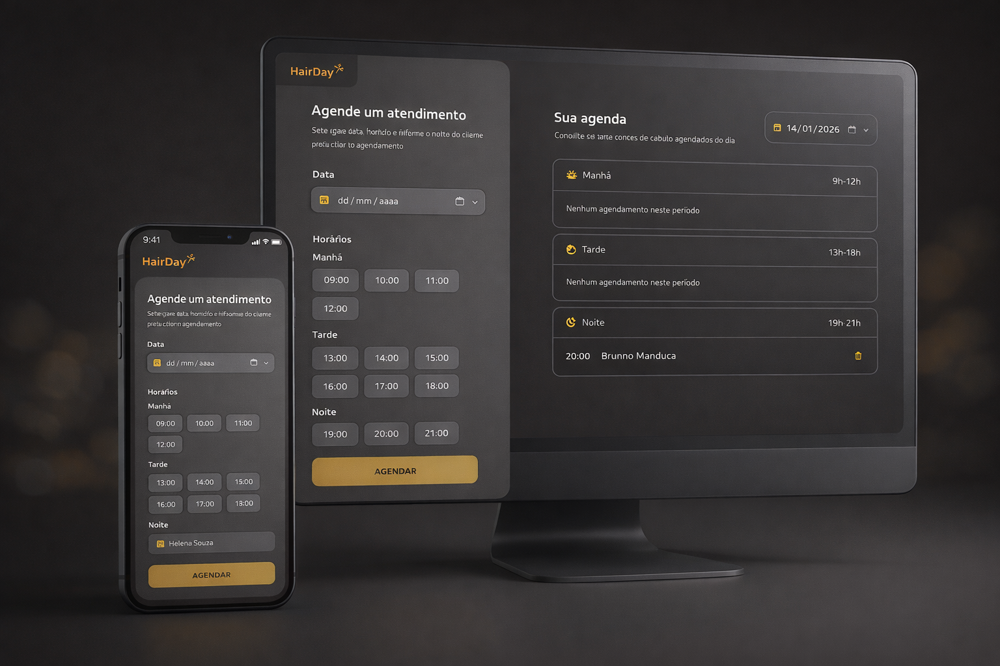
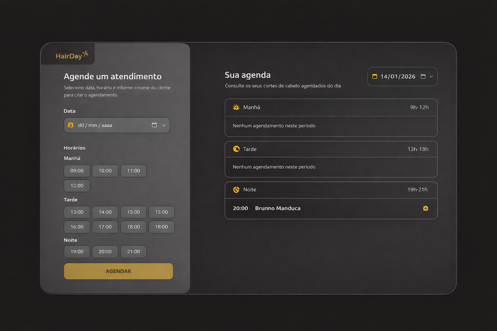

# Hair Day

Hair Day é uma aplicação de agendamento de horários para salões de beleza, desenvolvida como parte da formação em React da Rocketseat. O projeto permite que os usuários agendem, visualizem e gerenciem seus compromissos.

## Mockup


## Versão Web


## ✨ Funcionalidades

-   **Agendamento de Horários**: Selecione data, horário e informe o nome do cliente.
-   **Visualização da Agenda**: Consulte os agendamentos do dia, divididos por períodos (manhã, tarde e noite).
<!-- -   **Tema Claro/Escuro**: Alterne entre os temas para melhor visualização. -->

## 🚀 Tecnologias Utilizadas

-   [React](https://reactjs.org/)
-   [Vite](https://vitejs.dev/)
-   [TypeScript](https://www.typescriptlang.org/)
-   [Tailwind CSS](https://tailwindcss.com/)
-   [Day.js](https://day.js.org/) para manipulação de datas

## ⚙️ Pré-requisitos

Antes de começar, você vai precisar ter instalado em sua máquina as seguintes ferramentas:
-   [Git](https://git-scm.com)
-   [Node.js](https://nodejs.org/en/)
-   Um gerenciador de pacotes como [NPM](https://www.npmjs.com/) ou [Yarn](https://yarnpkg.com/)

## 📦 Instalação

Siga os passos abaixo para configurar o ambiente de desenvolvimento:

```bash
# Clone este repositório
$ git clone https://github.com/seu-usuario/hair-day.git

# Acesse a pasta do projeto no terminal
$ cd hair-day

# Instale as dependências
$ npm install
```

## ▶️ Executando o Projeto

Após instalar as dependências, execute o seguinte comando para iniciar o servidor de desenvolvimento:

```bash
npm run dev
```

O servidor será iniciado em `http://localhost:5173`.

## Scripts Disponíveis

No arquivo `package.json`, você encontrará os seguintes scripts:

-   `dev`: Inicia o servidor de desenvolvimento com Vite.
-   `build`: Compila o projeto com TypeScript e faz o build com Vite para produção.
-   `preview`: Inicia um servidor local para visualizar a versão de produção.

## 📁 Estrutura do Projeto

O projeto está organizado da seguinte forma:

```
/
├── public/               # Arquivos estáticos
└── src/
    ├── assets/           # Ícones e imagens
    ├── components/       # Componentes de UI genéricos
    ├── core-components/  # Componentes principais da aplicação
    ├── hooks/            # Hooks customizados
    ├── lib/              # Funções utilitárias
    ├── models/           # Definições de tipos e modelos
    └── pages/            # Páginas da aplicação
```