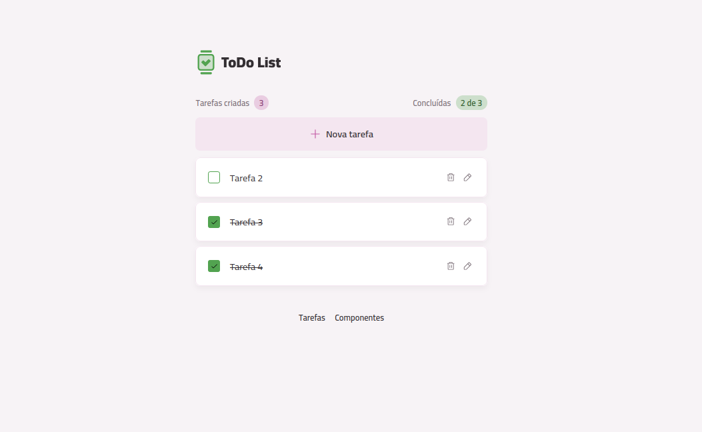

# Projeto ToDo

Uma aplicação de lista de tarefas (To-Do List) moderna e funcional, construída com React, TypeScript e Vite, focada em componentes reutilizáveis e uma ótima experiência de usuário.

## 📸 Visualização

<!-- Adicione aqui um screenshot da aplicação -->


## ✨ Funcionalidades Detalhadas

-   **Adicionar Tarefas**: Criação de novas tarefas com um campo de texto.
-   **Marcar como Concluída**: Alterne o estado de uma tarefa entre pendente e concluída com um clique.
-   **Editar Tarefas**: Altere o nome de uma tarefa existente diretamente na lista.
-   **Excluir Tarefas**: Remova tarefas da lista.
-   **Contadores Dinâmicos**: A interface exibe em tempo real o número total de tarefas criadas e o número de tarefas concluídas.
-   **Persistência de Dados**: As tarefas são salvas no **Local Storage** do navegador, para que não se percam ao recarregar a página.
-   **Feedback Visual**: A aplicação simula um estado de carregamento inicial e fornece feedback instantâneo para ações como deletar uma tarefa em processo de criação, melhorando a experiência do usuário.

## 🚀 Tecnologias Utilizadas

-   **Framework**: [React](https://react.dev/)
-   **Linguagem**: [TypeScript](https://www.typescriptlang.org/)
-   **Build Tool**: [Vite](https://vitejs.dev/) - Para um desenvolvimento rápido e otimizado.
-   **Estilização**: [Tailwind CSS](https://tailwindcss.com/) - Para uma estilização utilitária e eficiente.
-   **Lint & Formatação**: [Biome](https://biomejs.dev/) - Ferramenta all-in-one para garantir a qualidade e consistência do código.
-   **Roteamento**: [React Router](https://reactrouter.com/) - Para a estruturação das páginas.
-   **Hooks**: `use-local-storage` para uma fácil persistência de dados.

## 🏛️ Decisões de Arquitetura

Este projeto foi estruturado com foco na criação de um mini **sistema de design**, promovendo a reutilização e a manutenibilidade.

-   **Gerenciamento de Estado com Hooks**:
    -   `useTasks`: Hook centralizador que gerencia a lista completa de tarefas, incluindo a lógica de busca, contagem e simulação de loading inicial.
    -   `useTask`: Hook responsável pelo estado de uma única tarefa, como o controle entre o **modo de edição** e o **modo de visualização**.
-   **Componentização em Duas Camadas**:
    -   `src/components`: Contém componentes de UI **genéricos e reutilizáveis** (ex: `Button`, `Card`, `InputText`), que formam a base do sistema de design.
    -   `src/core-components`: Contém componentes **específicos da aplicação** (ex: `TaskItem`, `TasksList`), que combinam os componentes genéricos para construir as funcionalidades principais.
-   **Composição e Fonte da Verdade Única**: Componentes como `Text` exportam suas variantes de estilo. Isso permite que outros componentes (como um `Card`) usem os mesmos estilos de forma consistente, estabelecendo uma fonte única da verdade para o design.

## 📂 Estrutura do Projeto

```
src/
├── assets/         # Ícones, fontes e imagens
├── components/     # Componentes de UI genéricos e reutilizáveis (a base do design system)
├── core-components/ # Componentes específicos que compõem a UI da aplicação
├── hooks/          # Hooks customizados para lógica de estado (useTasks, useTask)
├── models/         # Definições de tipos e interfaces do TypeScript (Task)
├── pages/          # Componentes de nível de página que organizam o layout
├── App.tsx         # Componente raiz que configura o roteamento
├── main.tsx        # Ponto de entrada da aplicação React
└── index.css       # Estilos globais e configuração do Tailwind
```

## ▶️ Começando

Para executar este projeto localmente, siga os passos abaixo:

1.  **Clone o repositório**

2.  **Instale as dependências**
    ```bash
    npm install
    ```

3.  **Execute o servidor de desenvolvimento**
    ```bash
    npm run dev
    ```
    A aplicação estará disponível em `http://localhost:5173`.

## 🛠️ Scripts Disponíveis

-   `npm run dev`: Executa a aplicação em modo de desenvolvimento.
-   `npm run build`: Compila a aplicação para produção.
-   `npm run lint`: Executa o linter (Biome) para análise do código.
-   `npm run preview`: Serve a build de produção localmente para teste.